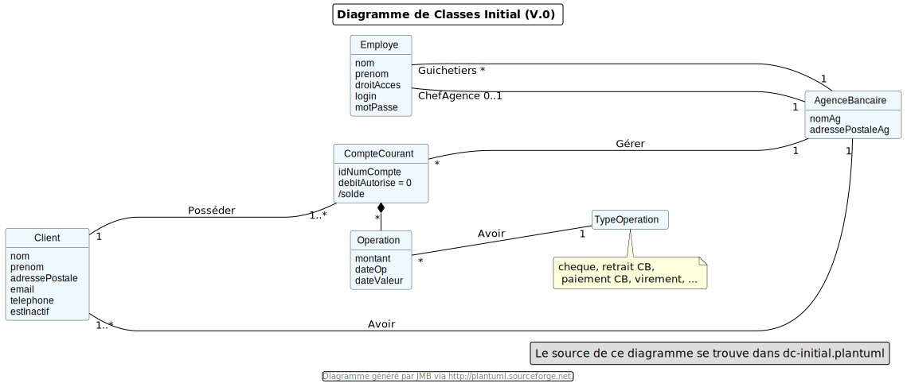

= Cahier des charges DailyBank - Version : 1.0 - Date : 10 mai 2023 Groupe 4B02 - Rédigé par Ahmad KHALIL
:icons: font
:models: models
:experimental:
:incremental:
:numbered:
:toc: macro
:window: _blank
:correction!:

// Useful definitions
:asciidoc: http://www.methods.co.nz/asciidoc[AsciiDoc]
:icongit: icon:git[]
:git: http://git-scm.com/[{icongit}]
:plantuml: https://plantuml.com/fr/[plantUML]
:vscode: https://code.visualstudio.com/[VS Code]

ifndef::env-github[:icons: font]
// Specific to GitHub
ifdef::env-github[]
:correction:
:!toc-title:
:caution-caption: :fire:
:important-caption: :exclamation:
:note-caption: :paperclip:
:tip-caption: :bulb:
:warning-caption: :warning:
:icongit: Git
endif::[]

toc::[]

== Présentation du sujet

Pour s'adapter aux exigences d'instantanéité de leurs clients, les banques françaises ont accentué leurs efforts de restructuration et leurs investissements dans le digital. Des chantiers longs et coûteux. Par exemple, la Banque Postale a indiqué que sa banque mobile baptisée Ma French Bank sera disponible dans les bureaux de Poste au printemps 2019. Mais les banques ne se contentent pas de créer des offres alternatives : elles rénovent aussi en profondeur leurs services de banque au quotidien. 

[quote, Rémy Weber, Président du directoire de La Banque Postale lors de la présentation des résultats de la banque]
On ne peut pas proposer une banque digitale qui permet d'ouvrir un compte en quelques minutes et en parallèle offrir des services bancaires bien moins rapides. Il nous faut faire les deux en même temps.

Au sein des réseaux de banque de détail, cela se traduit par des investissements majeurs dans la modernisation des outils de bureautique des guichetiers, et dans la robotisation des tâches automatisables. Un exercice qui s'accompagne de restructurations et, dans certains cas, d'une refonte du réseau. 

Ainsi, le modèle organisationnel de BNP Paribas, basé sur une structure historique hiérarchique, vit actuellement une petite révolution, alors qu'il évolue vers une approche transversale et pluridisciplinaire. "De la phase de la simulation d'un emprunt à la signature de l'acte définitif chez le notaire,  il faut que nous puissions suivre notre client sans interruption et que nous sachions (tout comme lui) en permanence où il en est", décrit Sophie Heller (directeur des opérations). Les équipes seront ainsi réparties en fonction de parcours clients – achat d'un bien, projet d'investissement ou de retraite, succession… Pour chacun de ces "projets de vie", des professionnels de diverses disciplines (marketeurs, développeurs, designers mais aussi des fonctions "juridiques" ou "risque") interagissent pour développer les parcours et les trajectoires de chaque client, captées, traitées, mises à jour et accessibles par tous en temps réel. "Cela nécessite de profonds changements culturels et organisationnels, en plus d'une nouvelle architecture IT", évalue Sophie Heller.

Sources :

- Les échos février 2018 : Banques, des restructurations menées tambour battant
- JDN Février 2018 : BNP Paribas accélère sa transformation digitale 

== Analyse de l'existant 

=== Version existante (V0)

Dans la version existante (V0), un guichetier peut :

- Modifier informations client (adresse, téléphone, …)
- Créer un nouveau client
- Consulter un compte
- Débiter un compte (BD)

Dans la version existante (V0), un chef d’agence peut :

- Rendre inactif un client

.Diagramme des Cas d'Utilisation initial
image::LV0/Docs/UseCaseV0.png[]

.Diagramme de classe de la version initiale

=== Versions à développer

Voici l’ordre de développement des UCfootnote:[Cas d'utilisation] à respecter dans les différentes versions du logiciel (V1, V2)

Cas d’utilisation à développer dans la *Version 1* :

* Guichetier :
** Créditer/débiter un compte (java et BD avec procédure stockée)
** Créer un compte
** Effectuer un virement de compte à compte
** Clôturer un compte
* Chef d’Agence :
** Gérer (faire le « CRUD ») les employés (guichetier et chef d’agence)

ifdef::correction[]
[%collapsible]
.Diagrammes de la V1 image:icons/solution.png[] 
====
.Diagramme des Cas d'Utilisation V1
image::{models}/uc-initialv1.svg[]

.Diagramme de classe de la V1
image::{models}/dc-initialv1.svg[]

====
endif::[]

Cas d’utilisation à développer dans la *Version 2* :

* Guichetier :
** Générer un relevé mensuel d’un compte en PDF
** Gérer (faire le « CRUDfootnote:[_Create Read Update Delete_] ») les prélèvements automatiques
* Chef d’Agence :  uniquement les spécifications
** Effectuer un Débit exceptionnel
** Simuler un emprunt
** Simuler une assurance d’emprunt

ifdef::correction[]
[%collapsible]
.Diagrammes de la V2 image:icons/solution.png[] 
====
.Diagramme des Cas d'Utilisation V2
image::{models}/uc-initialv2.svg[]

.Diagramme de classe de la V2
image::{models}/dc-initialv2.svg[]

====
endif::[]

Eventuellement, pour aller plus loin :

* Chef d’Agence :  
** Les spécifications finalisées de la version 2
** Supers options pour les tops … 
** Développer une ou plusieurs fonctionnalités au choix et selon vos compétences
* « Batch »: 
** Générer les relevés mensuels en PDF
** Exécuter les prélèvements automatiques

== Analyse des besoins

== Analyse des contraintes

=== Contraintes techniques : 
- Le système doit avoir une interface graphique simple pour les utilisateurs.
- Le système doit être développé en utilisant Java.
- Le système doit utiliser une BD avec une procédure stockée pour les transactions bancaires.
- Le système doit être sécurisé avec un système d'authentification pour l'accès aux fonctionnalités.

=== Contraintes organisationnelles : 

* Travail en équipe de 3 à 4 étudiants
* Dépot sous GITHUB de vos codes et de vos documentations
* 6 séances d'autonomie en gestion de projet et 10 séances d'autonomie en développement 
* 1 séance guidée en gestion de projet pour préparer l'oral et faire le suivi du projet
* 6 tds d'accompagnement en développement
* Des intervenants en gestion de projet (EP et PGA) et des intervenants en developpement (AP, JMB, MDM, MFC, SA)
* Tous les étudiants rédigent au moins un peu, tous les étudiants codent au moins une fonctionnalité :  Sur les docs les initiales de ceux qui ont rédigés doivent apparaitre dans le sommaire à la fin de chaque titre. Un étudiant qui code une fonctionnalité rédige  doc technique, cahier de tests et doc utilisateur correspondants.
