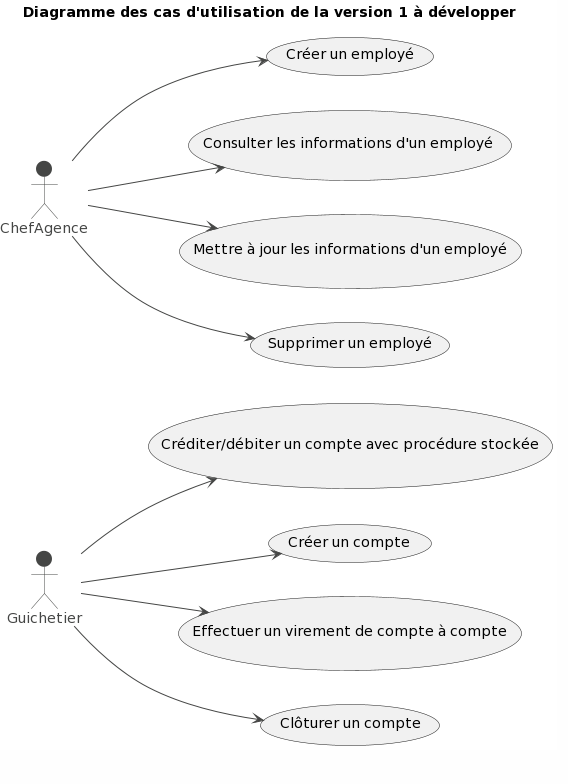

= Document Technique Utilisateur DailyBank - Version : 1.0 - Date : 10 mai 2023 Groupe 4B02 - Rédigé par Ahmad KHALIL
:icons: font
:models: models
:experimental:
:incremental:
:numbered:
:toc: macro
:window: _blank
:correction!:

// Useful definitions
:asciidoc: http://www.methods.co.nz/asciidoc[AsciiDoc]
:icongit: icon:git[]
:git: http://git-scm.com/[{icongit}]
:plantuml: https://plantuml.com/fr/[plantUML]

ifndef::env-github[:icons: font]
// Specific to GitHub
ifdef::env-github[]
:correction:
:!toc-title:
:caution-caption: :fire:
:important-caption: :exclamation:
:note-caption: :paperclip:
:tip-caption: :bulb:
:warning-caption: :warning:
:icongit: Git
endif::[]

Équipe de développement :
- Chef de projet : Marwan ALMASRI
- Développeurs : Ahmad KHALIL, Rayan SELLOU, Marwan ALMASRI

toc::[]

== Présentation de l'application
=== Contexte général
L'objectif de ce projet est de développer une application de gestion des comptes clients et les employés. Cette application sera déployée dans les 100 agences que compte le réseau de la banque DailyBank, dans le cadre de la restructuration de ses services bancaires. L'application doit permettre de gérer des comptes bancaires de dépôt pour des clients préalablement créés et de débiter ou créditer un compte soit par virement, soit par une personne physique se présentant devant un guichet. Le développement de cette application permettra de répondre au problème de l'obsolescence des outils actuels de gestion des comptes clients ainsi que des employés de la banque DailyBank, ainsi qu'à la nécessité de moderniser et de digitaliser les services bancaires pour satisfaire les attentes des clients en termes d'instantanéité et de rapidité. En outre, l'application permettra de simplifier la gestion des comptes clients pour les employés des agences, de réduire les erreurs et les risques de fraude, et d'améliorer la qualité de service offerte aux clients.

=== Explication des cas d'utilisations

Dans la version existante (V0) de l'application de gestion des comptes clients de DailyBank, le guichetier dispose de plusieurs fonctionnalités. Il peut modifier les informations d'un client telles que son adresse ou son numéro de téléphone. Il a également la possibilité de créer un nouveau client en entrant ses informations personnelles dans l'application. Il peut consulter les informations d'un compte client, notamment le solde et l'historique des transactions. Enfin, il peut effectuer un débit sur un compte client, c'est-à-dire retirer de l'argent.

Quant au chef d'agence, il a la possibilité de rendre un client inactif dans l'application, ce qui signifie que le compte ne pourra plus être utilisé pour effectuer des transactions. Ces fonctionnalités sont limitées et ne permettent pas une gestion complète et optimisée des comptes clients de la banque. Il est donc nécessaire de développer une nouvelle version de l'application pour répondre aux nouveaux besoins de DailyBank dans le cadre de la restructuration de ses services bancaires. Voici le diagramme de cas d'utilisation qui présente les fonctionnalités citées qui sont présentes dans la version existante :

image::../../LV0/Docs/UseCaseV0.png[]

Version existante (V0)
  - Le guichetier peut modifier les informations d'un client telles que son adresse ou son numéro de téléphone.
  - Le guichetier peut créer un nouveau client en entrant ses informations personnelles dans l'application.
  - Le guichetier peut consulter les informations d'un compte client, notamment le solde et l'historique des transactions.
  - Le guichetier peut effectuer un débit sur un compte client, c'est-à-dire retirer de l'argent.
  - Le chef d'agence peut rendre un client inactif dans l'application, ce qui signifie que le compte ne pourra plus être utilisé pour effectuer des transactions. 

Version développé (V1)
- L'application doit permettre aux guichetiers de créditer/débiter un compte client en entrant le montant de la transaction.
- Les guichetiers doivent être en mesure de créer un nouveau compte client en entrant ses informations personnelles dans l'application.
- L'application doit permettre aux guichetiers d'effectuer un virement de compte à compte pour un même client.
- Les guichetiers doivent être en mesure de clôturer un compte client à la demande du client ou en cas de fraude ou de comportement frauduleux.
- Le chef d'agence doit être en mesure de gérer les employés (guichetiers et chefs d'agence) de manière à pouvoir créer, lire, mettre à jour et supprimer des comptes employés.

Ces exigences doivent être satisfaites dans la version 1 de l'application pour répondre aux besoins de DailyBank en matière de gestion de ses comptes clients et employés.
Voici le diagramme de cas d’utilisation qui présente les fonctionnalités citées de la V1 qui seront à développer :

=== Explication des diagrammes de classes

image::../../LV1/Docs/dc-initialv1.svg[]
Le diagramme de classes UML représente les différentes entités impliquées dans une banque, notamment les employés, les agences, les clients, les comptes courants, les opérations bancaires et les types d'opérations. Les relations entre ces entités sont également représentées, telles que la relation de possession entre un client et un compte courant, la relation de gestion entre un compte courant et une agence, et la relation de couverture entre un emprunt et une assurance. On retrouve également le chef d'agence qui est représenté comme un employé avec une relation d'association avec une agence bancaire (0..1 car il peut y avoir au maximum 1 chef d'agence par agence). Les clients inactifs sont également pris en compte avec un attribut booléen "estInactif" dans la classe Client. Il y a aussi l'attribut "estCloturé" dans la classe CompteCourant pour déterminer si le compte est clôturé ou non.

== Architecture du projet 
=== Ressources externes
=== Structuration de l'application
=== Eléments à connaître

== Analyse des besoins

== Analyse des contraintes

=== Contraintes techniques
- Le système doit avoir une interface graphique simple pour les utilisateurs.
- Le système doit être développé en utilisant Java.
- Le système doit utiliser une Base de donnée Oracle pour stocker les transactions bancaires.
- Le système doit être sécurisé avec un système d'authentification pour l'accès aux fonctionnalités.

=== Contraintes organisationnelles
- Travail en équipe de 3 à 4 étudiants
