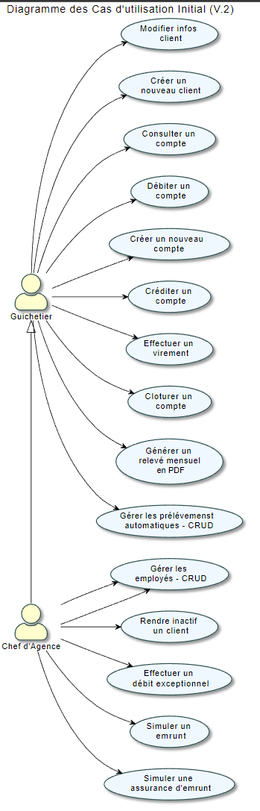

= Cahier de recette DailyBank - Version : 2.0 - Date : 25 mai 2023 Groupe 4B02 - Rédigé par Ahmad KHALIL
:icons: font
:models: models
:experimental:
:incremental:
:numbered:
:toc: macro
:window: _blank
:correction!:

// Useful definitions
:asciidoc: http://www.methods.co.nz/asciidoc[AsciiDoc]
:icongit: icon:git[]
:git: http://git-scm.com/[{icongit}]
:plantuml: https://plantuml.com/fr/[plantUML]

ifndef::env-github[:icons: font]
// Specific to GitHub
ifdef::env-github[]
:correction:
:!toc-title:
:caution-caption: :fire:
:important-caption: :exclamation:
:note-caption: :paperclip:
:tip-caption: :bulb:
:warning-caption: :warning:
:icongit: Git
endif::[]

Équipe de développement :
- Chef de projet : Marwan ALMASRI
- Développeurs : Ahmad KHALIL, Rayan SELLOU, Marwan ALMASRI

toc::[]

== Présentation de l'application
=== Contexte général
Dans le cadre de la restructuration de ses services bancaires, la banque DailyBank souhaite développer une application de gestion des comptes clients et employés, qui sera déployée dans ses 100 agences. L'objectif est de moderniser et de digitaliser les services bancaires pour répondre aux attentes des clients en termes d'instantanéité et de rapidité, tout en simplifiant la gestion des comptes pour les employés des agences. L'application, nommée DailyBank, sera développée en Java-Oracle pour remplacer les outils obsolètes actuels.

=== Description du besoin
La banque BankUniv souhaite développer une nouvelle application Java-Oracle de gestion des comptes clients afin de remplacer plusieurs outils obsolètes. L'objectif est de s'adapter aux avancées technologiques et de répondre aux besoins croissants des clients en matière de services bancaires numériques. En effet, les avancées technologiques ont incité les banques à investir dans la numérisation de leurs services pour améliorer l'accessibilité et l'expérience client.

L'application DailyBank sera utilisée par les guichetiers et les directeurs d'agence pour gérer les comptes bancaires des clients. Elle remplacera l'ancienne application mobile qui était limitée en termes de fonctionnalités. L'objectif principal est de permettre aux utilisateurs de réaliser des opérations courantes telles que les dépôts, les retraits et les virements, tout en offrant une interface conviviale pour une utilisation efficace. Le développement de cette application permettra de résoudre le problème de l'obsolescence des outils actuels de gestion des comptes clients et employés, tout en améliorant la qualité de service offerte aux clients et en réduisant les erreurs et les risques de fraude.

== Fonctionnalités de la V0

=== Cas d'utilisation de la V0

image::../../LV0/Docs/UseCaseV0.png[]

=== Test des fonctionnalités V0 

==== Créer un nouveau client

|====
>|Cas de test 4+|Test-01-01
>|Titre 4+|Création d'un nouveau client
>|Objectif 4+| Vérifier qu'il est possible de créer un nouveau client

5+|
^|ID ^|Action ^|Comportement attendu ^|Pré-conditions ^|Résultat
^|All_G_C.1 ^|Cliquer sur le bouton "Nouveau client". ^|La fenêtre de création des clients s'ouvre. ^| Les champs saisies doivent être valides. ^|OK
^|All_G_C.2 ^|Compléter les champs spécifiés et valider. ^|Un nouveau client est créé. ^|aucune ^|OK

5+|

5+|Commentaire :
Si on ne valide pas les champs, la création du compte est annulé.
|====

==== Modifier les informations d'un client

|====
>|Cas de test 4+|Test-01-02
>|Titre 4+|Modification d'un client
>|Objectif 4+| Vérifier qu'il est possible de modifier un client

5+|

^|ID ^|Action ^|Comportement attendu ^|Pré-conditions ^|Résultat
^|All_G_C.3 ^|Cliquer sur le bouton "Modifier client". ^|La fenêtre de modification des données du clients s'ouvre. ^|Le client est sélectionné ^|OK
^|All_G_C.4 ^|Modifier les champs souhaités et confirmer. ^|Retour sur les informations du client. Le client est modifié. ^|La fenêtre modifier client est active ^|OK
^|All_G_C.5 ^|Modifier les champs souhaités et annuler. ^|Retour sur les informations du client. Le client est inchangé. ^|La fenêtre modifier client est active ^|OK
|====

==== Consulter le compte d'un client

|====
>|Cas de test 4+|Test-01-03
>|Titre 4+|Consultation d'un compte
>|Objectif 4+| Vérifier qu'il est possible de consulter un compte

5+|

^|ID ^|Action ^|Comportement attendu ^|Pré-conditions ^|Résultat
^|All_G_CB.3 ^|Cliquer sur le bouton "Comptes client". ^|La page des comptes du client s’affiche. ^|aucune ^|OK
^|All_G_CB.4 ^|Sélectionner le bouton "Voir opérations". ^|La page des opérations du compte s’affiche. ^|Choisir un compte parmi la liste des comptes ^|OK
...
|====

==== Débiter un compte

|====
>|Cas de test 4+|Test-01-04
>|Titre 4+|Débiter un compte
>|Objectif 4+| Vérifier qu'il est possible de débiter un compte

5+|

^|ID ^|Action ^|Comportement attendu ^|Pré-conditions ^|Résultat
^|All_G_COP.1 ^|Cliquer sur le bouton "Comptes client". ^|La page des comptes du client s’affiche. ^| Un client actif est sélectionné. ^|OK
^|All_G_COP.2 ^|Cliquer sur le bouton "Voir opérations". ^|La page de gestion des opérations du compte s’affiche. ^| Un compte actif est sélectionné. ^|OK
^|All_G_COP.3 ^|Cliquer sur le bouton "Débiter". ^|La page des débit du compte s’affiche. ^| Le compte n'est pas clôturé. ^|OK
^|All_G_COP.4  ^|Rentrer un montant 50 dans le champ "Montant". ^|Le nouveau solde a été soustrait du montant de 50. On a créé une nouvelle opération dans la liste des opérations avec le bon montant. ^| Le compte selectionné doit avoir son solde qui soustrait au montant du débit doit être supérieur au découvert autorisé, le montant du débit doit être compris entre 1 et 999999 (limite de la BD). ^|OK
^|All_G_COP.5  ^|Rentrer un montant < 0 dans le champ "Montant". ^|Blocage ! + pop-up ^|aucune ^|OK
^|All_G_COP.6  ^|Rentrer un montant > 999 999 dans le champ "Montant". ^|Blocage ! + pop-up ^|aucune ^|OK
|====

==== Rendre inactif un client

|====
>|Cas de test 4+|Test-01-05
>|Titre 4+|Rendre inactif un client
>|Objectif 4+| Vérifier qu'il est possible de rendre un client inactif

5+|

^|ID ^|Action ^|Comportement attendu ^|Pré-conditions ^|Résultat
^|All_G_C.3 ^|Cliquer sur le bouton "Modifier client". ^|La fenêtre de modification des données du clients s'ouvre. ^|Le client est sélectionné ^|OK
^|All_G_C.4 ^|Au niveau de la partie "Client actif ?", selectionner le bouton "inactif". ^|Le bouton inactif est selectionné. ^| Le bouton inactif doit être selectionné. ^|OK
^|All_G_C.5 ^|Cliquez sur Modifier. ^|Retour sur les informations du client. Le client est désormais inactif. ^|aucune ^|OK
|====

== Fonctionnalités de la V1

=== Cas d'utilisation de la V1

image::../../LV1/Docs/ressources/UseCaseV1.PNG[]

=== Test des fonctionnalités V1

==== Créer un compte (SELLOU Rayan)

|====
>|Cas de test 4+|Test-02-01
>|Titre 4+|Création d'un compte
>|Objectif 4+| Vérifier qu'il est possible de créer un compte

5+|

^|ID ^|Action ^|Comportement attendu ^|Pré-conditions ^|Résultat
^|All_G_CB.1 ^|Cliquer sur le bouton "Nouveau Compte". ^|La page de création de compte s’affiche. ^|Aucune ^|OK
^|All_G_CB.2 ^|Compléter les champs spécifiés et valider (en appuyant sur le boutton "Ajouter"). ^|Un nouveau compte est créé. On a créé un nouveau compte dans la liste des comptes du client sélectionné. ^|Les montants saisies doivent être valides : valeur <= 0 pour le découvert autorisé et montant >= pour le solde. ^|OK
^|All_G_CB.2 ^|Saisir des montants invalides lors de la création du compte. ^|Une erreur doit apparaître indiquant les erreurs de saisies à corriger. ^| Saisir un montant de découvert autorisé > 0 et un solde < 0. ^|OK
|====

==== Créditer un compte (SELLOU Rayan)

|====
>|Cas de test 4+|Test-02-02
>|Titre 4+|Créditer un compte
>|Objectif 4+| Vérifier qu'il est possible de créditer un compte

5+|

^|ID ^|Action ^|Comportement attendu ^|Pré-conditions ^|Résultat
^|All_G_COP.1 ^|Cliquer sur le bouton "Comptes client". ^|La page des comptes du client s’affiche. ^| Un client actif est sélectionné. ^|OK
^|All_G_COP.2 ^|Cliquer sur le bouton "Voir opérations". ^|La page de gestion des opérations du compte s’affiche. ^| Un compte actif est sélectionné. ^|OK
^|All_G_COP.3 ^|Cliquer sur le bouton "Créditer". ^|La page des crédits du compte s’affiche. ^| Le compte n'est pas clôturé. ^|OK
^|All_G_COP.4  ^|Rentrer un montant 50 dans le champ "Montant". ^|Le nouveau solde a été ajoutée du montant de 50. On a créé une nouvelle opération dans la liste des opérations avec le bon montant. ^| Le montant du crédit doit être compris entre 1 et 999999 (limite de la BD). ^|OK
^|All_G_COP.5  ^|Rentrer un montant < 0 dans le champ "Montant". ^|Blocage ! + pop-up ^|aucune ^|OK
^|All_G_COP.6  ^|Rentrer un montant > à 999 999 dans le champ "Montant". ^|Blocage ! + pop-up ^|aucune ^|OK
|====

==== Clôturer un compte (Marwan Al-Masri)

|====
|Cas de test 4+|Test-02-03
|Titre 4+|Clôturer un compte
|Objectif 4+| Vérifier qu'il est possible de clôturer un compte

5+|

^|ID ^|Action ^|Comportement attendu ^|Pré-conditions ^|Résultat
^|All_G_CB.5 ^|Cliquer sur le bouton "Comptes client". ^|La page des comptes du client s'affiche. ^|Un client actif est sélectionné ^|OK
^|All_G_CB.6 ^|Sélectionner le compte à clôturer et cliquer sur le bouton "Clôturer le compte". ^|La fenêtre de confirmation de clôture s'affiche. ^|Le compte à clôturer est sélectionné ^|OK
^|All_G_CB.7 ^|Confirmer la clôture du compte (appuyer sur confirmer). ^|Le compte est clôturé et n'apparaît plus sur la page des comptes du client. ^|La fenêtre de confirmation de clôture est active ^|OK
^|All_G_CB.8 ^|Annuler la clôture du compte (appuyer sur annuler). ^|Le compte n'est pas clôturé et reste sur la page des comptes du client. ^|La fenêtre de confirmation de clôture est active ^|OK
^|All_G_CB.9 ^|Selection d'un compte qui est déjà clôturé. ^|Le bouton Clôturer va se désactiver. ^|Un compte clôturé doit être selectionné ^|OK
|====

==== Effectuer un virement de compte à compte (KHALIL Ahmad)

|====
>|Cas de test 4+|Test-02-04
>|Titre 4+|Effectuer un virement
>|Objectif 4+| Vérifier qu'il est possible d'effectuer un virement

5+|

^|ID ^|Action ^|Comportement attendu ^|Pré-conditions ^|Résultat
^|All_G_COP.13 ^|Cliquer sur le bouton "Comptes client". ^|La page des comptes du client s’affiche. ^| Un client actif est sélectionné ^|OK
^|All_G_COP.14 ^|Cliquer sur le bouton "Voir opérations". ^|La page de gestion des opérations du compte s’affiche. ^| Un compte actif est sélectionné ^|OK
^|All_G_COP.15 ^|Cliquer sur le bouton "Virement". ^|La page d'enregistrement du virement s’affiche. ^| Le compte ne doit pas être clôturé. ^|OK
^|All_G_COP.16  ^|Rentrer un montant > 0 dans le champ "Montant" et selectionner un compte destinataire dans la liste. ^|Le nouveau solde du compte selectionné est ajouté au montant. On a créé une nouvelle opération dans la liste des opérations avec le bon montant. ^| Le montant est un chiffre/nombre, et est postif. Le montant entré soustrait au solde du compte actuelle ne doit pas être en dessous du découvert autorisé. ^|OK
^|All_G_COP.17  ^|Rentrer un montant < 0 dans le champ "Montant". ^|Blocage ! + pop-up ^| aucune. ^|OK
^|All_G_COP.18  ^|Rentrer un montant > 999 999 dans le champ "Montant". ^|Blocage ! + pop-up ^| aucune. ^|OK
^|All_G_COP.19  ^|Faire un virement vers un compte clôturé. ^|Impossible car seuls les comptes qui ne sont pas clôturés s'affichent dans la liste.| Le client doit avoir des comptes ouverts et clôturés pour faire ce test. ^|OK
|====

==== CRUD Employé - Create (KHALIL Ahmad)

|====
>|Cas de test 4+|Test-02-05
>|Titre 4+|Création d'un nouvel employé (CRUD - C)
>|Objectif 4+| Vérifier qu'il est possible de créer un nouvel employé

5+|
^|ID ^|Action ^|Comportement attendu ^|Pré-conditions ^|Résultat
^|All_G_E.1 ^|Cliquez sur la gestion des employés dans le menu. ^|La fenêtre de création des employés s'ouvre. ^| Il faut être connecté à un compte Chef d'Agence ^|OK
^|All_G_E.2 ^|Cliquer sur le bouton "Ajouter". ^|La fenêtre de création des employés s'ouvre. ^| Il faut être connecté à un compte Chef d'Agence ^|OK
^|All_G_E.3 ^|Compléter les champs spécifiés et valider (en appuyant sur le boutton "Valider"). ^|Un nouvel employé est créé. ^|Il faut être connecté à un compte Chef d'Agence et les informations saisies doivent êtres valides. ^|OK
^|All_G_E.4 ^|Saisir des informations non valides. ^|Un alerte doit s'afficher avec les informations qui sont manquantes / non valides. ^|Il faut être connecté à un compte Chef d'Agence et des informations non valides doivent êtres saisies.^|O

5+|

5+|Commentaire :
Si tous les champs sont valides mais que l'utilisateur clique sur le bouton "Annuler", l'action est annulé et la fenêtre de création des employés se ferme.
|====

==== CRUD Employé - Read (Marwan Al-Masri)

|====
>|Cas de test 4+|Test-02-06
>|Titre 4+|Consultation des informations d'un employé (CRUD - R)
>|Objectif 4+| Vérifier qu'il est possible de consulter les informations d'un employé

5+|
^|ID ^|Action ^|Comportement attendu ^|Pré-conditions ^|Résultat
^|All_G_E.5 ^|Cliquez sur la gestion des employés dans le menu. ^|La fenêtre de création des employés s'ouvre. ^| Il faut être connecté à un compte Chef d'Agence ^|OK
^|All_G_E.6 ^|Cliquer sur le bouton "Informations". ^|La page des informations de l'employé s’affichent, si un chef d'agence est selectionné, les logins et mot de passe seront masqués. ^| Il faut être connecté à un compte Chef d'Agence. Un employé doit être sélectionné. ^|OK

5+|
|====

==== CRUD Employé - Update (KHALIL Ahmad)

|====
>|Cas de test 4+|Test-02-07
>|Titre 4+|Modification d'un employé (CRUD - U)
>|Objectif 4+| Vérifier qu'il est possible de modifier un employé

5+|

^|ID ^|Action ^|Comportement attendu ^|Pré-conditions ^|Résultat
^|All_G_E.7 ^|Cliquez sur la gestion des employés dans le menu. ^|La fenêtre de création des employés s'ouvre. ^| Il faut être connecté à un compte Chef d'Agence ^|OK
^|All_G_E.8 ^|Cliquer sur le bouton "Mettre à jour". ^|La fenêtre de modification des données de l'employé s'ouvre. ^|Il faut être connecté à un compte Chef d'Agence. L'employé est sélectionné. L'employé sélectionné n'est pas un Chef d'Agence. ^|OK
^|All_G_E.9 ^|Modifier les champs souhaités et confirmer (en appuyant sur le boutton "Modifier"). ^|Retour sur les informations de l'employé. L'employé est modifié. ^|La fenêtre modifier employé est active et les informations modifiées doivent êtres valides.^|OK
^|All_G_E.10 ^|Modifier les champs souhaités et annuler (en appuyant sur le boutton annuler). ^|Retour sur les informations de l'employé. L'employé est inchangé. ^|La fenêtre modifier employé est active ^|OK
^|All_G_E.11 ^|Saisir des informations non valides. ^|Un alerte doit s'afficher avec les informations qui sont manquantes / non valides. ^|Il faut être connecté à un compte Chef d'Agence et des informations non valides doivent êtres saisies.^|O

5+|

5+|Commentaire :
Si tous les champs sont valides mais que l'utilisateur clique sur le bouton "Annuler", l'action est annulé et la fenêtre d'édition des employés se ferme.
|====

==== CRUD Employé - Delete (KHALIL Ahmad)

|====
>|Cas de test 4+|Test-02-08
>|Titre 4+|Supprimer un employé (CRUD  - D)
>|Objectif 4+| Vérifier qu'il est possible de supprimer un employé

5+|

^|ID ^|Action ^|Comportement attendu ^|Pré-conditions ^|Résultat
^|All_G_E.11 ^|Cliquez sur la gestion des employés dans le menu. ^|La fenêtre de création des employés s'ouvre. ^| Il faut être connecté à un compte Chef d'Agence ^|OK
^|All_G_E.12 ^|Cliquer sur le bouton "Supprimer". ^|Une alerte de confirmation s'affiche. ^| Il faut être connecté à un compte Chef d'Agence. L'employé est sélectionné. L'employé sélectionné n'est pas un Chef d'Agence. ^|OK
^|All_G_E.13 ^|Cliquer sur supprimer et valider (en appuyant sur le boutton confirmer). ^|Mises à jour sur de la liste des employés. L'employé est supprimé. ^|Il faut être connecté à un compte Chef d'Agence. L'employé est sélectionné. L'employé sélectionné n'est pas un Chef d'Agence. ^|OK
^|All_G_E.14 ^|Cliquer sur supprimer et annuler (en appuyant sur le boutton annuler). ^|Retour sur les informations de l'employé. L'employé est inchangé. ^|Il faut être connecté à un compte Chef d'Agence. L'employé est sélectionné. L'employé sélectionné n'est pas un Chef d'Agence. ^|OK

5+|
|====

== Fonctionnalités de la V2

=== Cas d'utilisation de la V2

=== Test des fonctionnalités V2

==== Effectuer un débit exceptionnel (Marwan Al-Masri)

|====
>|Cas de test 4+|Test-03-01
>|Titre 4+| Débit exceptionnel
>|Objectif 4+| Vérifier le débit exceptionnel d'un compte client

^|ID ^|Action ^|Comportement attendu ^|Pré-conditions ^|Résultat
^|All_G_DEP.1 ^|Cliquez sur le bouton "Gestions", puis sur "Client". |La page de gestion des clients s'affiche.| Etre connecté en tant qu'employé.|OK
^|All_G_DEP.2 ^|Sélectionnez un client, puis cliquez sur le bouton "Comptes client". |La page du client s'ouvre.|Un client doit être selectionné.|OK
^|All_G_DEP.3 ^|Sélectionnez un compte, puis cliquez sur le bouton "Voir opérations".|La page de gestion des opérations s'ouvre.|Un compte doit être selectionné.|OK
^|All_G_DEP.4 ^|Cliquez sur le bouton "Enregistrer Débit".|La page "Enregistrement d'une opération" s'ouvre.|Le compte ne doit pas être clôturé.|OK
^|All_G_DEP.5 ^|Saisissez le montant, sélectionnez le type d'opération.|Le débit est effectué avec succès (retour à la page "Gestion des opérations").|Le montant saisi soustrait au solde actuelle du compte doit dépasser le découvert autorisé.|OK
^|All_G_COP.6 ^|Cliquez sur le bouton "Effectuer un débit".|Une alerte de confirmation qui demande à l'utilisateur s'il s'agit d'un débit exceptionnel apparaît.|Le montant saisi soustrait au solde actuelle du compte doit dépasser le découvert autorisé.|OK
^|All_G_COP.7 ^|Cliquz sur confirmez dans l'alerte de confirmation.|Retour sur la gestion des opérations et le débit est bien inséré.|Le montant saisi soustrait au solde actuelle du compte doit dépasser le découvert autorisé. L'employé doit être un chef d'agence.|OK

5+|
|====

==== Simuler un emprunt (SELLOU Rayan)

|====
>|Cas de test 4+|Test-03-02
>|Titre 4+| Simuler un emprunt
>|Objectif 4+| Vérifier que la simulation d'emprunt fonctionne

^|ID ^|Action ^|Comportement attendu ^|Pré-conditions ^|Résultat
^|All_G_SE.1 ^|Cliquez sur le bouton "Gestions", puis sur "Client". |La page de gestion des clients s'affiche.| Etre connecté en tant qu'employé.|OK
^|All_G_SE.2 ^|Sélectionnez un client, puis cliquez sur le bouton "Comptes client". |La page du client s'ouvre.|Un client doit être selectionné.|OK
^|All_G_SE.3 ^|Cliquez sur le bouton "Simuler emprunt/assu".|La page de simulation des emprunts s'ouvre.|aucune.|OK
^|All_G_SE.4 ^|Remplisser les montants à saisir au niveau de "Simulation Emprunt".|Les montants sont initialisés.|aucune.|OK
^|All_G_SE.5 ^|Valider la simulation d'emprunt en cliquant sur le bouton "Simulation Emprunt".|La simulation va se lancer et un tableau sera crée avec les périodes de remboursement.|Les montants saisies doivent êtres de chiffres / nombres et doivent êtres valides.|OK

5+|
|====

==== Simuler une assurance d'emprunt (SELLOU Rayan)

|====
>|Cas de test 4+|Test-03-03
>|Titre 4+| Simuler une assurance d'emprunt
>|Objectif 4+| Vérifier que la simulation de l'assurance d'emprunt fonctionne

^|ID ^|Action ^|Comportement attendu ^|Pré-conditions ^|Résultat
^|All_G_SE.1 ^|Cliquez sur le bouton "Gestions", puis sur "Client". |La page de gestion des clients s'affiche.| Etre connecté en tant qu'employé.|OK
^|All_G_SE.2 ^|Sélectionnez un client, puis cliquez sur le bouton "Comptes client". |La page du client s'ouvre.|Un client doit être selectionné.|OK
^|All_G_SE.3 ^|Cliquez sur le bouton "Simuler emprunt/assu".|La page de simulation des emprunts s'ouvre.|aucune.|OK
^|All_G_SE.4 ^|Remplisser les montants à saisir au niveau de "Simulation Assurance".|Les montants sont initialisés.|aucune.|OK
^|All_G_SE.5 ^|Valider la simulation de l'assurance d'emprunt en cliquant sur le bouton "Simulation Assurance".|La simulation va se lancer et un tableau sera crée avec les périodes de remboursement.|Les montants saisies doivent êtres de chiffres / nombres et doivent êtres valides.|OK

5+|
|====

==== Générer un relevé PDF (SELLOU Rayan)

|====
>|Cas de test 4+|Test-03-04
>|Titre 4+| Générer un relevé PDF d'un compte
>|Objectif 4+| Vérifier que le fichier PDF soit bien généré avec toutes les opérations du compte

^|ID ^|Action ^|Comportement attendu ^|Pré-conditions ^|Résultat
^|All_G_PDF.1 ^|Sélectionner le bouton "gestions" puis "client" |la page de gestion de client s'affiche| Etre connecté en tant qu'employé|ok
^|All_G_PDF.2 ^|Sélectionner un client puis sélectionner le bouton "Comptes client" |la page du client s'ouvre|Un client doit être selectionné |ok
^|All_G_PDF.3 ^|Sélectionner un compte puis sélectionner le bouton "Voir opérations"|la page de gestion des opérations s'ouvre|Un compte doit être selectionné.|ok
^|All_G_PDF.4 ^|Sélectionner le bouton "Générer PDF"|le fichier PDF ce génère et s'ouvre.|Aucune|ok

5+|
|====

==== CRUD Prélèvements - Create (KHALIL Ahmad) 

|====
>|Cas de test 4+|Test-03-05
>|Titre 4+| Créer un nouveau prélèvement
>|Objectif 4+| Vérifier qu'il est possible de créer un nouveau prélèvement

^|ID ^|Action ^|Comportement attendu ^|Pré-conditions ^|Résultat
^|All_G_CP.1 ^|Sélectionner le bouton "gestions" puis "client" |la page de gestion de client s'affiche| Etre connecté en tant qu'employé|ok
^|All_G_CP.2 ^|Sélectionner un client puis sélectionner le bouton "Comptes client" |la page du client s'ouvre|Un client doit être selectionné |ok
^|All_G_CP.3 ^|Sélectionner un compte puis sélectionner le bouton "Voir opérations"|la page de gestion des opérations s'ouvre|Un compte doit être selectionné.|ok
^|All_G_CP.4 ^|Sélectionner le bouton "Gérer les prélèvements".|La fenêtre de gestion des prélèvements s'ouvre et la liste des prélèvements associés au compte s'affichent.|Le compte ne doit pas être clôturé.|ok
^|All_G_CP.5 ^|Sélectionner le bouton "Créer".|La fenêtre de création des prélèvements s'ouvre.|aucune.|ok
^|All_G_CP.6 ^|Saisissez la date de récurrence, le bénéficiaire et le montant du prélèvement.|Les montants vont êtres initialisés.|La fenêtre de création du prélèvement doit être active.|ok
^|All_G_CP.7 ^|Cliquez sur validez.|La fenêtre de création de prélèvement va se fermer et le prélèvement va être ajoutée à la liste des prélèvements existants.|Les valeurs saisies doivent êtres valides : la date et le montant doivent êtres des chiffres / nombres, la date de récurrence doit être comprise entre 1 et 28 le montant doit être > 0. Le bénéficiaire ne doit pas être nulle.|ok
^|All_G_CP.8 ^|Remplir les champs souhaités et annuler (en appuyant sur le boutton annuler). ^|Retour sur la fenêtre de gestion des prélèvements. Rien n'a été ajouté. ^|aucune ^|OK

5+|
|====

==== CRUD Prélèvements - Read (KHALIL Ahmad)

|====
>|Cas de test 4+|Test-03-06
>|Titre 4+| Voir les informations d'un prélèvements
>|Objectif 4+| Vérifier que l'employé a bien accès aux informations des prélèvements

^|ID ^|Action ^|Comportement attendu ^|Pré-conditions ^|Résultat
^|All_G_RP.1 ^|Sélectionner le bouton "gestions" puis "client" |la page de gestion de client s'affiche| Etre connecté en tant qu'employé|ok
^|All_G_RP.2 ^|Sélectionner un client puis sélectionner le bouton "Comptes client" |la page du client s'ouvre|Un client doit être selectionné |ok
^|All_G_RP.3 ^|Sélectionner un compte puis sélectionner le bouton "Voir opérations"|la page de gestion des opérations s'ouvre|Un compte doit être selectionné.|ok
^|All_G_RP.4 ^|Sélectionner le bouton "Gérer les prélèvements".|La fenêtre de gestion des prélèvements s'ouvre et la liste des prélèvements associés au compte s'affichent avec toutes leurs informations.|Le compte ne doit pas être clôturé.|ok

5+|
|====

==== CRUD Prélèvements - Update (KHALIL Ahmad)

|====
>|Cas de test 4+|Test-03-07
>|Titre 4+| Mettre à jour un prélèvement
>|Objectif 4+| Vérifier qu'il est possible de mettre à jour un prélèvement

^|ID ^|Action ^|Comportement attendu ^|Pré-conditions ^|Résultat
^|All_G_UP.1 ^|Sélectionner le bouton "gestions" puis "client" |la page de gestion de client s'affiche| Etre connecté en tant qu'employé|ok
^|All_G_UP.2 ^|Sélectionner un client puis sélectionner le bouton "Comptes client" |la page du client s'ouvre|Un client doit être selectionné |ok
^|All_G_UP.3 ^|Sélectionner un compte puis sélectionner le bouton "Voir opérations"|la page de gestion des opérations s'ouvre|Un compte doit être selectionné.|ok
^|All_G_UP.4 ^|Sélectionner le bouton "Gérer les prélèvements".|La fenêtre de gestion des prélèvements s'ouvre et la liste des prélèvements associés au compte s'affichent.|Le compte ne doit pas être clôturé.|ok
^|All_G_UP.5 ^|Sélectionner le bouton "Mettre à jour".|La fenêtre d'édition des prélèvements s'ouvre.|Un prélèvement doit être selectionné.|ok
^|All_G_UP.6 ^|Modifier les champs souhaités.|Les montants vont êtres changés.|La fenêtre d'édition du prélèvement doit être active.|ok
^|All_G_UP.7 ^|Cliquez sur validez.|La fenêtre d'édition du prélèvement va se fermer et le prélèvement va se mettre à jour avec les nouvelles informations dans la liste des prélèvements existants.|Les nouvelles valeurs saisies doivent êtres valides : la date et le montant doivent êtres des chiffres / nombres, la date de récurrence doit être comprise entre 1 et 28 le montant doit être > 0. Le bénéficiaire ne doit pas être nulle.|ok
^|All_G_UP.8 ^|Modifier les champs souhaités et annuler (en appuyant sur le boutton annuler). ^|Retour sur la fenêtre de gestion des prélèvements. Rien n'a été modifiée. ^|aucune ^|OK

5+|
|====

==== CRUD Prélèvements - Delete (Marwan Al-Masri)

|====
>|Cas de test 4+|Test-03-08
>|Titre 4+| Supprimer un prélèvement
>|Objectif 4+| Vérifier qu'il est possible de supprimer un prélèvement

^|ID ^|Action ^|Comportement attendu ^|Pré-conditions ^|Résultat
^|All_G_DP.1 ^|Sélectionner le bouton "gestions" puis "client" |la page de gestion de client s'affiche| Etre connecté en tant qu'employé|ok
^|All_G_DP.2 ^|Sélectionner un client puis sélectionner le bouton "Comptes client" |la page du client s'ouvre|Un client doit être selectionné |ok
^|All_G_DP.3 ^|Sélectionner un compte puis sélectionner le bouton "Voir opérations"|la page de gestion des opérations s'ouvre|Un compte doit être selectionné.|ok
^|All_G_DP.4 ^|Sélectionner le bouton "Gérer les prélèvements".|La fenêtre de gestion des prélèvements s'ouvre et la liste des prélèvements associés au compte s'affichent.|Le compte ne doit pas être clôturé.|ok
^|All_G_DP.5 ^|Cliquer sur le bouton "Supprimer". ^|Une alerte de confirmation s'affiche. ^| Un prélèvement doit être selectionné. ^|OK
^|All_G_DP.6 ^|Cliquer sur supprimer et valider (en appuyant sur le boutton confirmer). ^|Mises à jour sur de la liste des prélèvements. Le prélèvement est supprimé. ^|Un prélèvement doit être selectionné.^|OK
^|All_G_DP.7 ^|Cliquer sur supprimer et annuler (en appuyant sur le boutton annuler). ^|Retour sur les informations des prélèvements. Le prélèvement est inchangé. ^|Un prélèvement doit être selectionné. ^|OK
5+|
|====

==== Batch - Prélèvements automatiques

|====
>|Cas de test 4+|Test-03-09
>|Titre 4+| Vérification d'un prélèvement automatique
>|Objectif 4+| Vérifier qu'un prélèvement automatique s'est bien exécutée.

^|ID ^|Action ^|Comportement attendu ^|Pré-conditions ^|Résultat
^|All_G_PA.1 ^|Repérer et noter un prélèvement existant (ou en ajouter un à la date de j+1) |Le prélèvement va s'exécuter à 0h00.| Le prélèvement doit exister.|ok
5+|
|====

==== Batch - Relevés mensuels

|====
>|Cas de test 4+|Test-03-10
>|Titre 4+| Vérification d'un relevé mensuel
>|Objectif 4+| Vérifier qu'un relevé mensuel a bien été crée

^|ID ^|Action ^|Comportement attendu ^|Pré-conditions ^|Résultat
^|All_G_PA.1 ^| Notez le nombre de fichier présents dans le dossier "ReleveComptes". |Des nouveaux relevés vont êtres généres à 0h00.| Il doit exister au minimum un compte.|ok
5+|
|====
