= Document Technique Utilisateur DailyBank - Version : 1.0 - Date : 10 mai 2023 Groupe 4B02 - Rédigé par Ahmad KHALIL
:icons: font
:models: models
:experimental:
:incremental:
:numbered:
:toc: macro
:window: _blank
:correction!:

// Useful definitions
:asciidoc: http://www.methods.co.nz/asciidoc[AsciiDoc]
:icongit: icon:git[]
:git: http://git-scm.com/[{icongit}]
:plantuml: https://plantuml.com/fr/[plantUML]

ifndef::env-github[:icons: font]
// Specific to GitHub
ifdef::env-github[]
:correction:
:!toc-title:
:caution-caption: :fire:
:important-caption: :exclamation:
:note-caption: :paperclip:
:tip-caption: :bulb:
:warning-caption: :warning:
:icongit: Git
endif::[]

Équipe de développement :
- Chef de projet : Marwan ALMASRI
- Développeurs : Ahmad KHALIL, Rayan SELLOU, Marwan ALMASRI

toc::[]

== Présentation de l'application
=== Contexte général
Dans le cadre de la restructuration de ses services bancaires, la banque DailyBank souhaite développer une application de gestion des comptes clients et employés, qui sera déployée dans ses 100 agences. L'objectif est de moderniser et de digitaliser les services bancaires pour répondre aux attentes des clients en termes d'instantanéité et de rapidité, tout en simplifiant la gestion des comptes pour les employés des agences. L'application, nommée DailyBank, sera développée en Java-Oracle pour remplacer les outils obsolètes actuels.

=== Description du besoin
La banque BankUniv souhaite développer une nouvelle application Java-Oracle de gestion des comptes clients afin de remplacer plusieurs outils obsolètes. L'objectif est de s'adapter aux avancées technologiques et de répondre aux besoins croissants des clients en matière de services bancaires numériques. En effet, les avancées technologiques ont incité les banques à investir dans la numérisation de leurs services pour améliorer l'accessibilité et l'expérience client.

L'application DailyBank sera utilisée par les guichetiers et les directeurs d'agence pour gérer les comptes bancaires des clients. Elle remplacera l'ancienne application mobile qui était limitée en termes de fonctionnalités. L'objectif principal est de permettre aux utilisateurs de réaliser des opérations courantes telles que les dépôts, les retraits et les virements, tout en offrant une interface conviviale pour une utilisation efficace. Le développement de cette application permettra de résoudre le problème de l'obsolescence des outils actuels de gestion des comptes clients et employés, tout en améliorant la qualité de service offerte aux clients et en réduisant les erreurs et les risques de fraude.

=== Cas d'utilisation

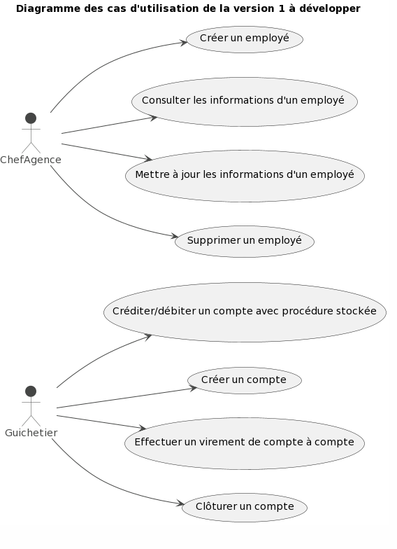

Version développé (V1)
- L'application doit permettre aux guichetiers de créditer/débiter un compte client en entrant le montant de la transaction.
- Les guichetiers doivent être en mesure de créer un nouveau compte client en entrant ses informations personnelles dans l'application.
- L'application doit permettre aux guichetiers d'effectuer un virement de compte à compte pour un même client.
- Les guichetiers doivent être en mesure de clôturer un compte client à la demande du client ou en cas de fraude ou de comportement frauduleux.
- Le chef d'agence doit être en mesure de gérer les employés (guichetiers et chefs d'agence) de manière à pouvoir créer, lire, mettre à jour et supprimer des comptes employés.

Ces exigences doivent être satisfaites dans la version 1 de l'application pour répondre aux besoins de DailyBank en matière de gestion de ses comptes clients et employés.
Voici le diagramme de cas d’utilisation qui présente les fonctionnalités citées de la V1 qui seront à développer :

== Architecture du projet 

=== Schéma globale

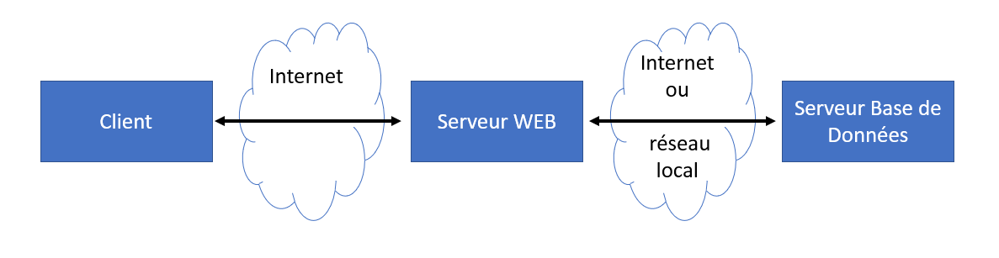

L'application Java DailyBank repose sur une architecture solide utilisant une base de données Oracle et le langage SQL. Au cœur de cette architecture se trouve la base de données Oracle, qui stocke et gère les informations relatives aux utilisateurs, aux comptes bancaires et aux transactions. Les employés interagissent avec l'application, envoyant des requêtes pour effectuer des opérations bancaires. L'application, composée de modules tels que les gestionnaires d'utilisateurs, de comptes et de transactions, traite ces requêtes, communique avec la base de données Oracle et effectue les opérations demandées. Cette architecture garantit une gestion efficace des données bancaires.

=== Diagramme de classe

image::../../LV1/Docs/ressources/dc-initialv1.svg[]

Le diagramme de classes UML représente les différentes entités impliquées dans une banque, notamment les employés, les agences, les clients, les comptes courants, les opérations bancaires et les types d'opérations. Les relations entre ces entités sont également représentées, telles que la relation de possession entre un client et un compte courant, la relation de gestion entre un compte courant et une agence, et la relation de couverture entre un emprunt et une assurance. On retrouve également le chef d'agence qui est représenté comme un employé avec une relation d'association avec une agence bancaire (0..1 car il peut y avoir au maximum 1 chef d'agence par agence). Les clients inactifs sont également pris en compte avec un attribut booléen "estInactif" dans la classe Client. Il y a aussi l'attribut "estCloturé" dans la classe CompteCourant pour déterminer si le compte est clôturé ou non.

=== Packages et ressources utilisées

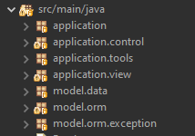

L'architecture de l'application DailyBank comprend plusieurs packages :  

- application : comporte le main permettant de lancer l'application ainsi que la classe qui permet de connaître l'état de l'application
- application.control : contient les contrôleurs et l'accès aux données, regroupés dans le package "application.control", sont responsables de la gestion des fonctionnalités de l'application. Ils traitent les requêtes des utilisateurs et assurent la liaison avec la base de données Oracle via les classes du package "model.orm".
- application.tools : fournit des outils d'aide supplémentaires facilitant ainsi le développement et la maintenance de l'application.
- application.view : contient les vues de l'application, gérée par le package "application.view", est basée sur des fichiers FXML et leurs contrôleurs associés. Chaque page FXML possède sa propre vue, garantissant une interface utilisateur claire et intuitive.
- model.data : contient des classes Java qui correspondent directement aux tables de la base de données. Chaque table est associée à une classe, permettant une gestion efficace des données et une cohérence entre l'application et la base de données.
- model.orm : classes par lesquels l'accès à la base de donnée est établie
- model.orm.exception : rassemble les classes d'exceptions liées à l'accès à la base de données. Ces classes permettent de gérer les erreurs et les situations exceptionnelles lors des opérations avec la base de données, assurant ainsi une gestion appropriée des problèmes d'accès aux données.

Les ressources utilisées par ce projet sont multiples : 

- maven pour la compilation, le jar, la javadoc ainsi que pour gérer les dépendances se trouvant dans le fichier pom.xml
- un jdk version 17 est nécéssaire 
- des fichiers FXML produits avec le logiciel SceneBuilder
- une base de données

== Configurer et lancer l'application

=== Pré-requis nécéssaires 
Pour pouvoir lancer l'application, assurez vous d'avoir java installé sur l'ordinateur, vous pouvez vérifier cela en lançant une invite de commande et en tapant la commande : 

- java -version 

Si JAVA n'est pas installé, rendez vous sur https://www.java.com/fr/download/ pour le télécharger.

- Lancer l'exécutable
Deux options : 

- Lancez une invite de commande et tappez la commande suivante : java -jar DailyBankV1.jar

- Double cliquez sur l'application (fichier nommée DailyBankV1.jar)

Si vous souhaitez lancer le projet depuis éclipse, il se nécéssaire d'installer le JDK 17. Il vous faudra aussi installer JavaFX depuis l'écplise MarketPlace (version recommandée : 3.8.0).

=== Se connecter

Pour lancer l'application, il sera nécéssaire de se connecter soit en tant que guichetier soit en tant que chef d'agence. Pour se connecter : 

- Appuyez sur le bouton 'connexion' comme ci-dessus puis entrer l'identifiant et le mot de passe.

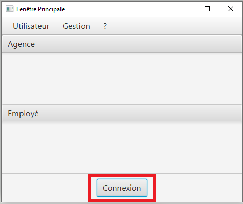

=== Configurez la base de données

Pour créer la base de données : 

- Copiez le script de création de la base de données située dans le fichier "scriptCreaBase.txt" qui se trouve dans le backpage "basededonnee"
- Collez ce script dans votre logiciel de base de données (ex : SQL Developper) puis exécutez le

Pour faire le lien avec la base de données : 

- Ouvrir la classe "LogToDatabase.java" située dans le package model.orm
- à la ligne 23 et 24, entrez le nom d'utilisateur et le mot de passe d'accès à votre base de données
- sauvegardez la classe et voilà le lien sera établie

== Fonctionnalités développées

=== Créer un compte bancaire (SELLOU Rayan)
Permet à un employé de créer un compte bancaire qui sera enregistré dans la base de données. 

- Conditions : le découvert autorisé doit être <= 0 et le montant du premier dépôt doit être >= 0.

Partie du UseCase :

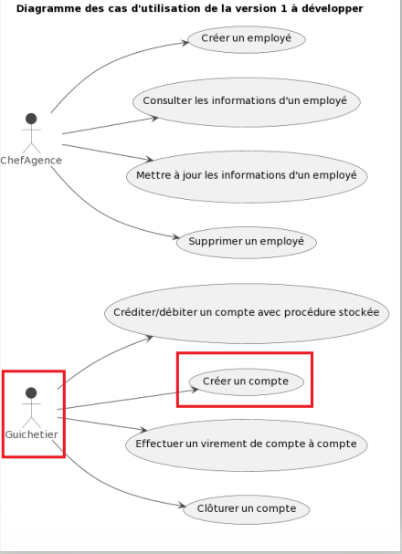

Partie du diagramme de classe : 

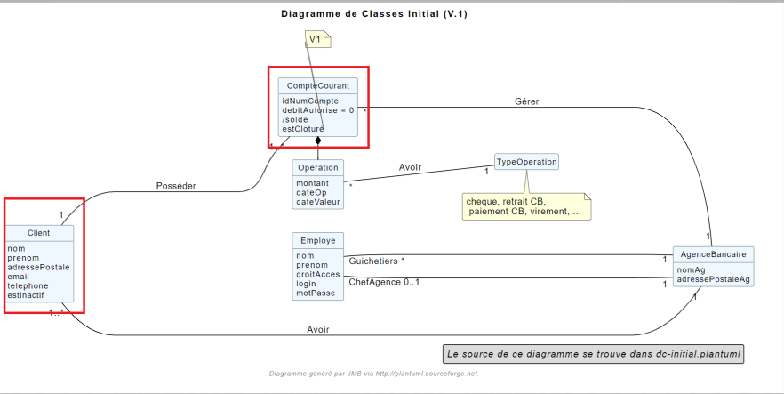

Diagramme de séquence : 

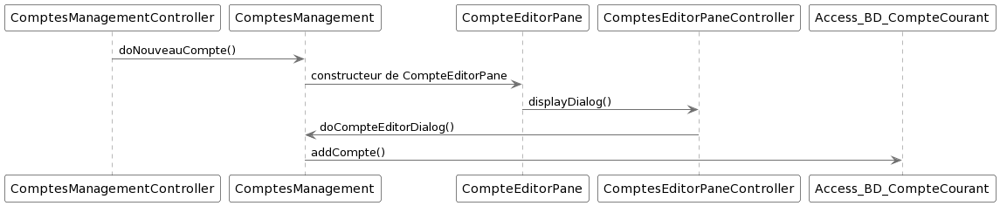

Classes utilisées : 

package Application.control :

- ComptesManagement -> la méthode *creerNouveauCompte* appelée par doNouveauCompte (ComptesManagementController)

- CompteEditorPane -> *constructeur de CompteEditorPane* && la méthode *doCompteEditorDialog* appelée par creerNouveauCompte (ComptesManagement)

package Application.view :

- ComptesManagementController -> la méthode *doNouveauCompte* appelée par comptesmanagement.fxml (bouton nouveau compte sur la scène)

- ComptesEditorPaneController -> la méthode *displayDialog* appelée par doCompteEditorDialog (CompteEditorPane)

package Model.orm :

- Access_BD_CompteCourant -> la méthode *addCompte* appelée par creerNouveauCompte (ComptesManagement)

=== Créditer / Débiter un compte (SELLOU Rayan)
Permet de créditer / débiter un compte bancaire, son solde sera actualisé dans la base de données. 

- Conditions : Le solde de noit pas dépasser le découvert autorisé lors d'un débit. Le montant maximal est de 999 999 pour un crédit / débit (limite de la base de données).

Partie du UseCase :

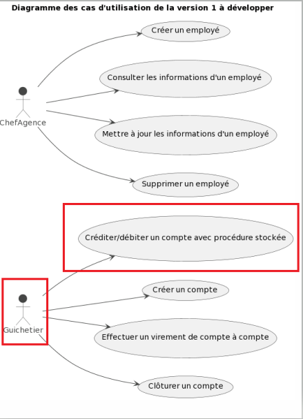

Partie du diagramme de classe : 

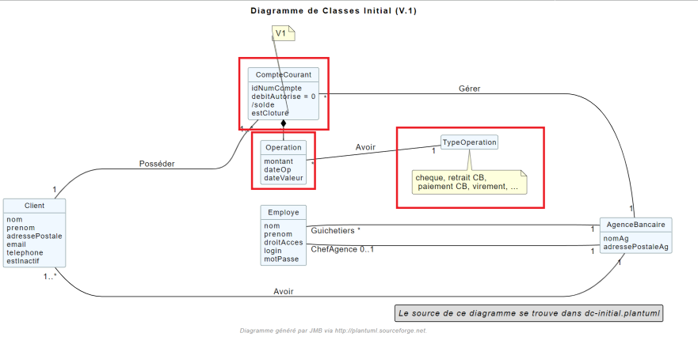

Diagramme de séquence : 

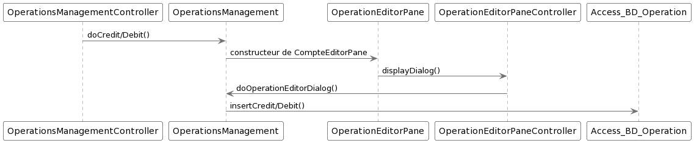

Classe utilisées : 

package Application.control :

- OperationsManagement -> la méthode *enregistrerCredit/Debit* appelée par doCredit/Debit (OperationsManagementController)

- OperationEditorPane -> *constructeur de CompteEditorPane* && la méthode *doCompteEditorDialog* appelée par enregistrerCredit/Debit (OperationsManagement)

package Application.view :

- OperationsManagementController -> la méthode *doCredit/Debit* appelée par operationsmanagement.fxml(bouton Crédit/Débit sur la scène)

- OperationEditorPaneController -> la méthode *displayDialog* appelée par doOperationEditorDialog (OperationEditorPane)

package Model.orm :

- Access_BD_Operation -> la méthode *insertCredit/Debit* appelée par enregistrerCredit/Debit (OperationsManagement)

=== Cloturer un compte (ALMASRI Marwan)
Change l'état d'un compte ouvert en un compte fermé, son état sera actualisé dans la base de données. 

- Conditions : le solde du compte à cloturer doit être à 0.

Partie du UseCase :

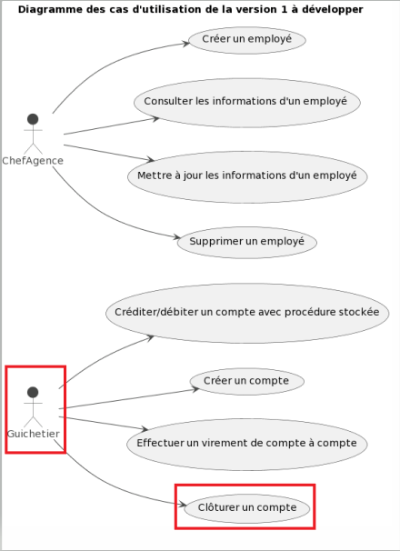

Partie du diagramme de classe : 

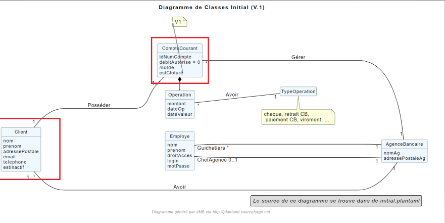

Diagramme de séquence : 

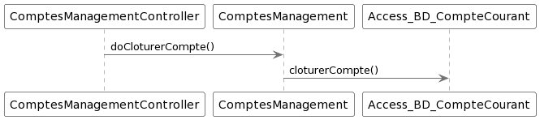

Classe utilisées :

package Application.control :

- ComptesManagement -> la méthode *cloturerCompte* appelée par doCloturerCompte (ComptesManagementController)

package Application.view :

- ComptesManagementController -> la méthode *doCloturerCompte* appelée par comptesmanagement.fxml (bouton cloturer sur la scène)

package Model.orm :

- Access_BD_CompteCourant -> la méthode *cloturerCompte* appelée par cloturerCompte (ComptesManagement)

=== Effectuer un virement (KHALIL Ahmad)
Débite le compte sur lequel l'opération est effectué et crédite le compte destinataire du virement, les soldes des deux comptes devra être actualisé dans la base de données. 

- Conditions : le solde ne doit pas dépasser le découvert autorisé et le montant maximal est de 999 999 (limite de la base de données).

Partie du UseCase :

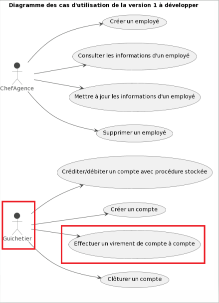

Partie du diagramme de classe : 

Diagramme de séquence : 

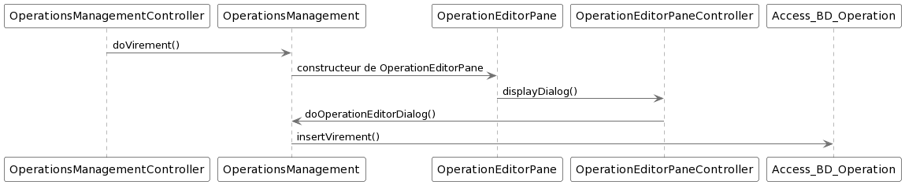

Classe utilisées :

package Application.control :

- OperationsManagement -> la méthode *enregistrerVirement* appelée par doVirement (OperationsManagementController)
- OperationEditorPane -> *constructeur de OperationEditorPane* && la méthode *doOperationEditorDialog* appelée par enregistrerVirement (OperationsManagement)

package Application.view :

- OperationsManagementController -> la méthode *doVirement* appelée par operationsmanagement.fxml (bouton virement sur la scène)
- OperationEditorPaneController -> la méthode *displayDialog* appelée par doOperationEditorDialog (OperationEditorPane)

package Model.orm :

- Access_BD_Operation -> la méthode *insertVirement* appelée par enregistrerVirement (OperationsManagement)

=== CRUD Employé - Create (KHALIL Ahmad)
Permet de créer un nouvel employé. L'employé sera également crée dans la base de données. 

- Conditions : les champs saisies doivent êtres valide, le numéro d'agence doit exister dans la base de données.

Partie du UseCase :

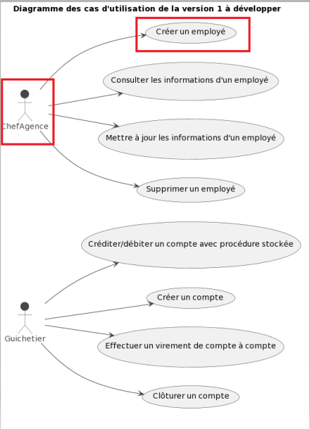

Partie du diagramme de classe : 

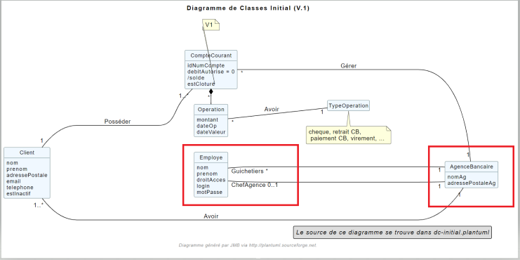

Diagramme de séquence : 

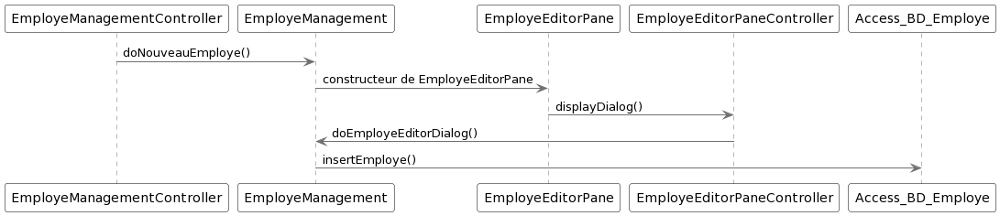

Classe utilisées :

package Application.control :

- EmployeManagement -> la méthode *nouveauEmploye* appelée par doNouveauEmploye (EmployeManagementController)
- EmployeEditorPane -> *constructeur de EmployeEditorPane* && la méthode *doEmployeEditorDialog* appelée par nouveauEmploye (EmployeManagement)

package Application.view :

- EmployeManagementController -> la méthode *doNouveauEmploye* appelée par employemanagement.fxml (bouton ajouter sur la scène)
- EmployeEditorPaneController -> la méthode *displayDialog* appelée par doEmployeEditorDialog (EmployeEditorPane)

package Model.orm :

- Access_BD_Employe -> la méthode *insertEmploye* appelée par nouveauEmploye (EmployeManagement)

=== CRUD Employé - Read (ALMASRI Marwan)

Permet de visualiser les informations d'un employés.

- Conditions : un chef d'agence ne peut pas voir les LOGINS d'un autre chef d'agence mais peut voir ceux des guichetiers

Partie du UseCase :

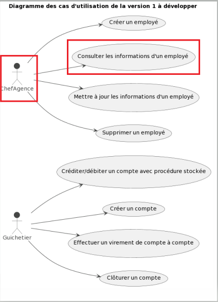

Partie du diagramme de classe : 

Diagramme de séquence : 

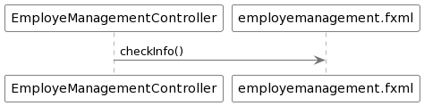

Classe utilisées :

package Application.view :

- EmployeManagementController.java -> checkInfo appelée par employemanagement.fxml (bouton information sur la scène)

=== CRUD Employé - UPDATE (KHALIL Ahmad)
Permet de mettre à jour les informations d'un employés, les champs mises à jour le seront également dans la base de données.

- Conditions : un chef d'agence ne peut pas modifier un autre chef d'agence mais peut modifier un guichetier

Partie du UseCase :

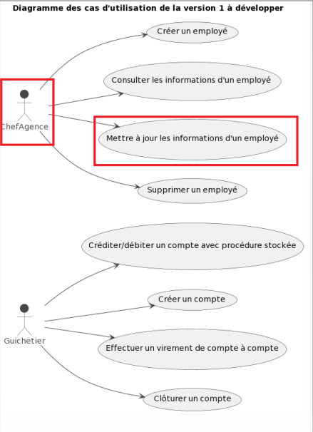

Partie du diagramme de classe : 

Diagramme de séquence : 

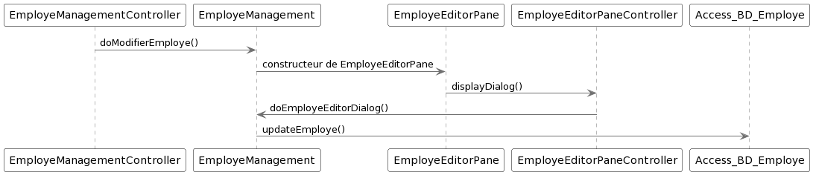

Classe utilisées :

package Application.control :

- EmployeManagement -> la méthode *modifierEmploye* appelée par doModifierEmploye (EmployeManagementController)
- EmployeEditorPane -> *constructeur de EmployeEditorPane* && la méthode *doEmployeEditorDialog* appelée par modifierEmploye (EmployeManagement)

package Application.view :

- EmployeManagementController -> la méthode *doModifierEmploye* appelée par employemanagement.fxml (bouton modifier sur la scène)
- EmployeEditorPaneController -> la méthode *displayDialog* appelée par doEmployeEditorDialog (EmployeEditorPane)

package Model.orm :

- Access_BD_Employe -> la méthode *updateEmploye* appelée par modifierEmploye (EmployeManagement)

=== CRUD Employé - DELETE (KHALIL Ahmad)
Supprime de manière définitive un employé, une alerte de confirmation est affichée lorsque un employé appuie sur ce bouton, à noter que les chefs d'agence ont le droit de supprimer seulement les guichetiers, pour supprimer un chef d'agence, il faudra les droits d'administrateur (V2). L'employé devra également être supprimé dans la base de données. 

- Conditions : un chef d'agence ne peut pas supprimer un autre chef d'agence mais peut supprimer un guichetier

Partie du UseCase :

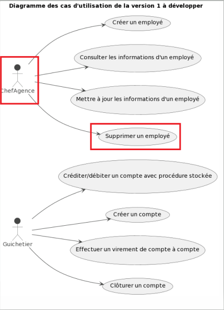

Partie du diagramme de classe : 

Diagramme de séquence : 

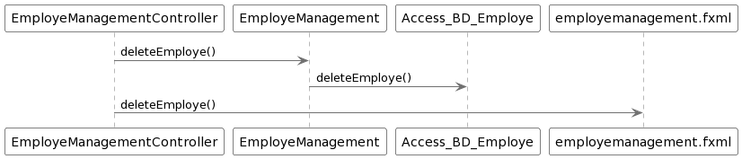

Classe utilisées :

package Application.control :

- EmployeManagement -> la méthode *deleteEmploye* appelée par deleteEmploye (EmployeManagementController)

package Application.view :

- EmployeManagementController -> la méthode *deleteEmploye* appelée par employemanagement.fxml (bouton supprimer sur la scène)

package Model.orm :

- Access_BD_Employe -> la méthode *deleteEmploye* appelée par deleteEmploye (EmployeManagement)
