= Document Utilisateur DailyBank - Version : 2.0 - Date : 26 mai 2023 Groupe 4B02 - Rédigé par Marwan AL MASRI
:icons: font
:models: models
:experimental:
:incremental:
:numbered:
:toc: macro
:window: _blank
:correction!:

// Useful definitions
:asciidoc: http://www.methods.co.nz/asciidoc[AsciiDoc]
:icongit: icon:git[]
:git: http://git-scm.com/[{icongit}]
:plantuml: https://plantuml.com/fr/[plantUML]

ifndef::env-github[:icons: font]
// Specific to GitHub
ifdef::env-github[]
:correction:
:!toc-title:
:caution-caption: :fire:
:important-caption: :exclamation:
:note-caption: :paperclip:
:tip-caption: :bulb:
:warning-caption: :warning:
:icongit: Git
endif::[]

Équipe de développement :
- Chef de projet : Marwan AL MASRI
- Développeurs : Ahmad KHALIL, Rayan SELLOU, Marwan ALMASRI

toc::[]

== Présentation de l'application
=== Contexte général
Dans le cadre de la restructuration de ses services bancaires, la banque DailyBank souhaite développer une application de gestion des comptes clients et employés, qui sera déployée dans ses 100 agences. L'objectif est de moderniser et de digitaliser les services bancaires pour répondre aux attentes des clients en termes d'instantanéité et de rapidité, tout en simplifiant la gestion des comptes pour les employés des agences. L'application, nommée DailyBank, sera développée en Java-Oracle pour remplacer les outils obsolètes actuels.

Dans un contexte plus général, l'évolution technologique a incité les banques à investir dans la numérisation de leurs services pour améliorer l'accessibilité et l'expérience client. La banque BankUniv, consciente de la concurrence des néobanques et des nouvelles attentes des clients, vise à offrir des services numériques efficaces et innovants. La pandémie de Covid-19 a également renforcé la demande des clients pour des services bancaires à distance.

=== Rôle de l'application
L'application DailyBank a pour objectif de fournir une solution complète de gestion des comptes clients et employés pour la banque DailyBank. En tant qu'outil essentiel dans la restructuration des services bancaires, l'application permettra de moderniser et de digitaliser les opérations bancaires, en offrant une plateforme conviviale et efficace pour les guichetiers et les directeurs d'agence. Son rôle principal est de permettre la gestion des comptes bancaires, en offrant des fonctionnalités telles que la création de comptes, les dépôts, les retraits, les virements et la consultation des soldes. L'application vise à simplifier les processus, à améliorer la qualité de service et à offrir une expérience client optimale en répondant aux besoins changeants des clients en matière de services bancaires numériques. En outre, elle contribuera à réduire les erreurs et les risques de fraude, en garantissant la sécurité des opérations effectuées. Ainsi, l'application DailyBank joue un rôle crucial dans la transformation numérique de la banque DailyBank, en fournissant une plateforme robuste et complète pour la gestion des comptes clients et en contribuant à maintenir la compétitivité de la banque sur le marché.

== Guide d'installation de l'application
=== Pré-requis nécéssaires 
Pour pouvoir lancer l'application, assurez vous d'avoir java installé sur l'ordinateur, vous pouvez vérifier cela en lançant une invite de commande et en tapant la commande : 

- java -version 

Si JAVA n'est pas installé, rendez vous sur https://www.java.com/fr/download/ pour le télécharger.

=== Lancer l'exécutable
Deux options : 

- Lancer une invite de commande et tappez la commande suivante : java -jar DailyBankV1.jar

- Double cliquez sur l'application (fichier nommée DailyBankV1.jar)

== Prise en main de l'application

=== Se connecter MAM RS AK

Première chose à faire dans l'application, se connecter soit en tant que guichetier soit en tant que chef d'agence. Pour se connecter : 

- Appuyer sur le bouton 'connexion' comme ci-dessus puis entrer l'identifiant et le mot de passe.

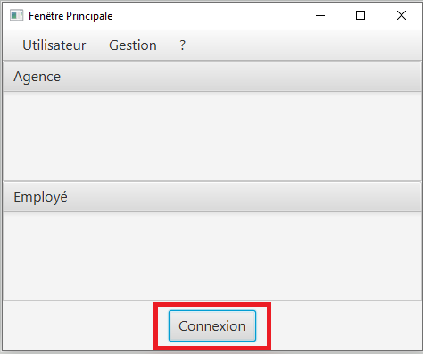

=== Créer un compte bancaire RS

- Conditions : le découvert autorisé doit être <= 0 et le montant du premier dépôt doit être >= 0.

- Une fois connectée, rendez vous dans -> 'Gestion' -> 'Clients' comme ci-dessous.

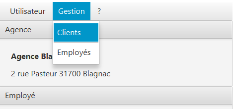

- Selectionnez un client puis cliquer sur 'Comptes client'.

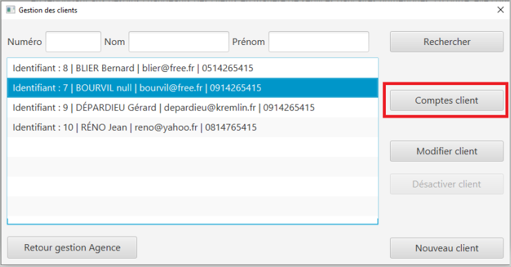

- Cliquez sur 'Nouveau Compte'.

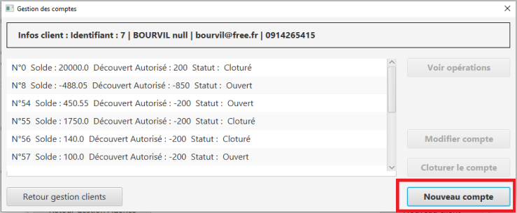

- Entrer le solde et le découvert autorisé du compte puis cliquez sur 'Ajouter'.

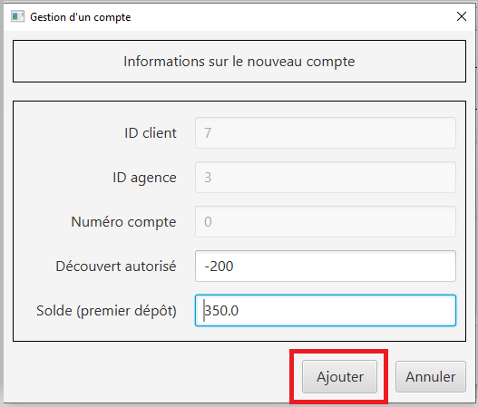

=== Créditer / Débiter un compte RS

- Conditions : Le solde de noit pas dépasser le découvert autorisé lors d'un débit. Le montant maximal est de 999 999 pour un crédit / débit (limite de la base de données).

- Une fois connectée, rendez vous dans -> 'Gestion' -> 'Clients' comme ci-dessous.

- Selectionnez un client puis cliquer sur 'Comptes client'.

image::ressources/docUtil3.PNG[]

- Selectionnez un client puis cliquer sur 'Voir opérations'.

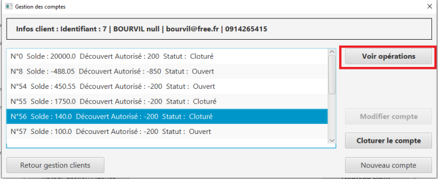

- Appuyez sur 'Créditer' ou 'Débiter'.

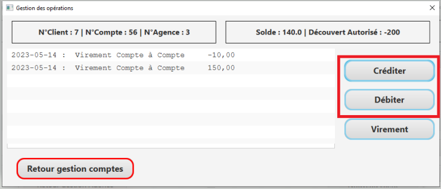

- Selectionnez le type d'opération dans le menu, ensuite entrez un montant puis effectuer le Crédit / Débit.

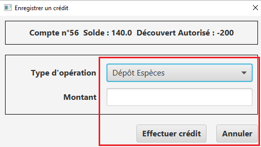

=== Cloturer un compte MAM

- Conditions : le solde du compte à cloturer doit être à 0.

- Une fois connectée, rendez vous dans -> 'Gestion' -> 'Clients' comme ci-dessous.

- Selectionnez un client puis cliquer sur 'Comptes client'.

- Selectionnez un compte puis cliquez sur 'Cloturer le compte', le statut du compte passera de 'Ouvert' à 'Cloturé'.

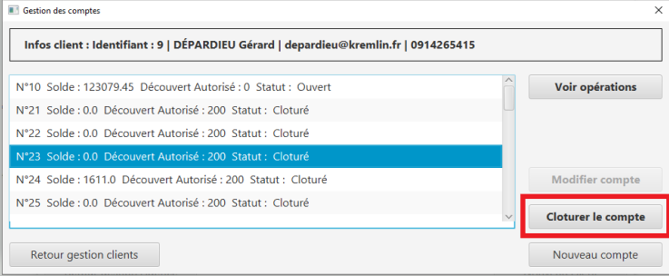

=== Effectuer un virement AK

- Conditions : le solde ne doit pas dépasser le découvert autorisé et le montant maximal est de 999 999 (limite de la base de données).

- Une fois connectée, rendez vous dans -> 'Gestion' -> 'Clients' comme ci-dessous.

- Selectionnez un client puis cliquer sur 'Comptes client'.

- Selectionnez un client puis cliquer sur 'Voir opérations'.

- Appuyez sur 'Virement'.

- Choisissez le compte destinataire dans le ménu déroulant, entrer le montant puis cliquez sur 'Effectuer virement'.

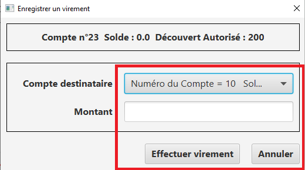

=== Créer un employé AK

- Conditions : les champs saisies doivent êtres valide, le numéro d'agence doit exister dans la base de données.

- Une fois connectée, rendez vous dans -> 'Gestion' -> 'Employe' comme ci-dessous.

image::../../LV1/Docs/urces/docUtil11.png[]

- Cliquez sur 'Ajouter'.

image::../../LV1/Docs/ssources/docUtil12.PNG[]

- Entrez les informations de l'employé puis cliquez sur 'Valider'

image::ressources/docUtil13.PNG[]

=== Voir un employé MAM
- Conditions : un chef d'agence ne peut pas voir les LOGINS d'un autre chef d'agence mais peut voir ceux des guichetiers

- Une fois connectée, rendez vous dans -> 'Gestion' -> 'Employe' comme ci-dessous.

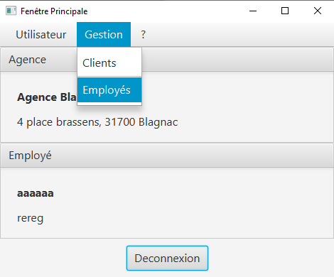

- Selectionnez un employé puis cliquez sur 'Informations'.

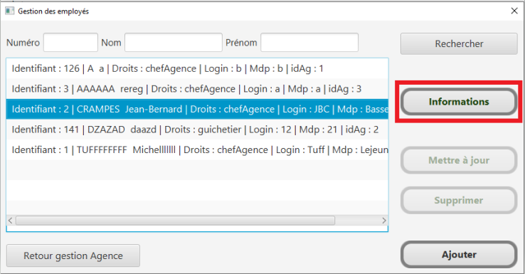

=== Mettre à jour un employé AK

- Conditions : un chef d'agence ne peut pas modifier un autre chef d'agence mais peut modifier un guichetier

- Une fois connectée, rendez vous dans -> 'Gestion' -> 'Employe' comme ci-dessous.

- Selectionnez un employé puis cliquez sur 'Mettre à jour'.

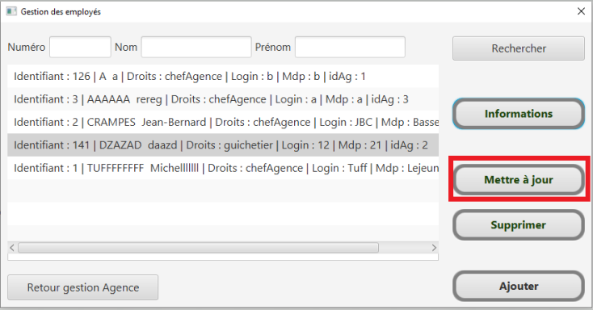

- Saisissez les informations à mettre à jour puis cliquez sur 'Modifier'.

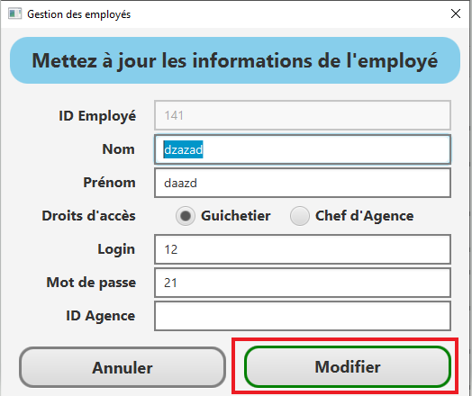

=== Supprimer un employé AK

- Conditions : un chef d'agence ne peut pas supprimer un autre chef d'agence mais peut supprimer un guichetier

- Une fois connectée, rendez vous dans -> 'Gestion' -> 'Employe' comme ci-dessous.

- Selectionnez un employé puis cliquez sur 'Supprimer'.

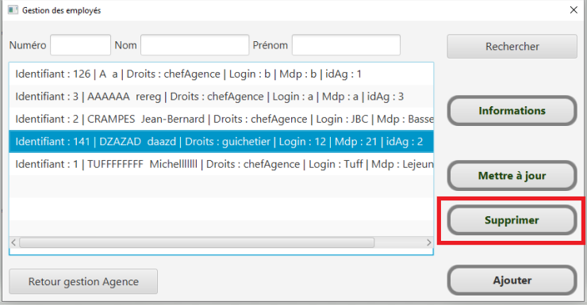

=== Débit exceptionnel MAM

- Conditions : Il faut être connecté à un compte Chef d'Agence

- Une fois connectée, rendez vous dans -> 'Gestion' -> 'Client' comme ci-dessous.

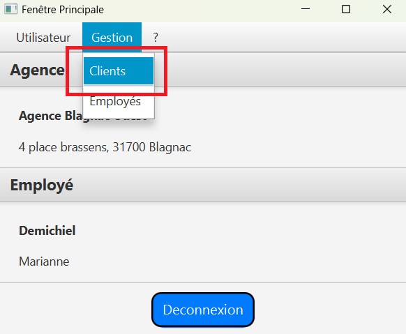

- Selectionnez un client puis cliquer sur 'Comptes client'.

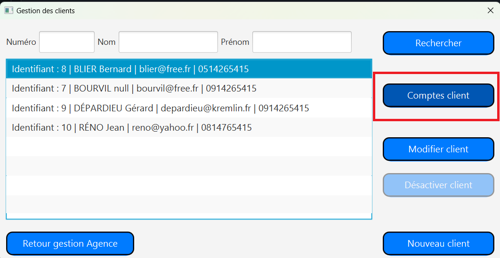

- Selectionnez un compte puis cliquer sur 'Voir opérations'.

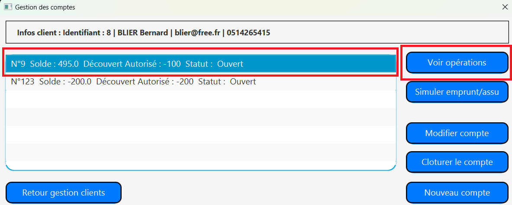

- Appuyez sur le bouton "Débiter" pour effectuer un débit sur le compte sélectionné précedemment.

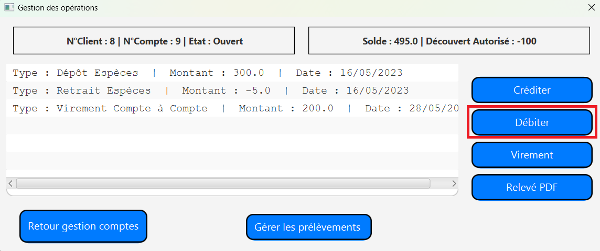

- Après avoir rentré un montant au dessus de votre plafond, vous pouvez effectuer le débit.

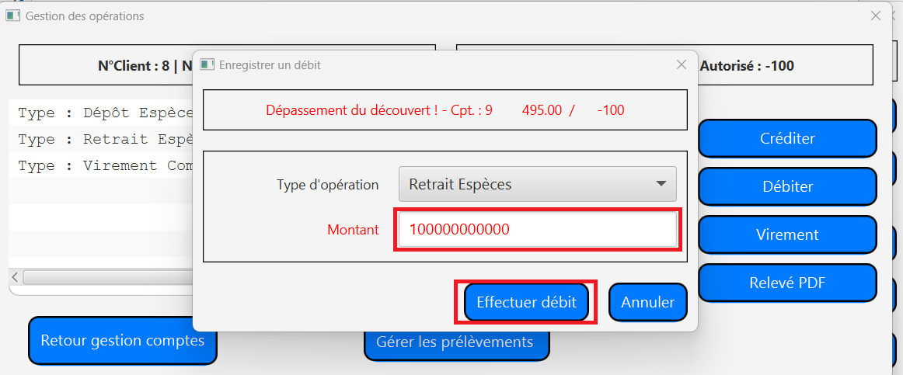

- Si vous souhaitez effectivement faire un débit exceptionnel, appuyez sur le bouton "OK", sinon simplement le bouton "Annuler".

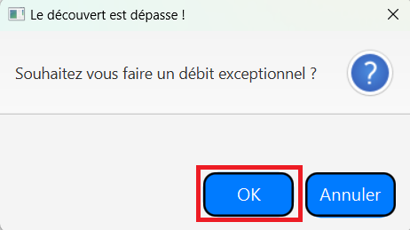

=== Simuler emprunt RS

- Conditions : Il faut être connecté à un compte Chef d'Agence

- Une fois connectée, rendez vous dans -> 'Gestion' -> 'Client' comme ci-dessous.

- Selectionnez un client puis cliquer sur 'Comptes client'.

- Appuyez ensuite sur le bouton 'Simuler emprunt / assu".

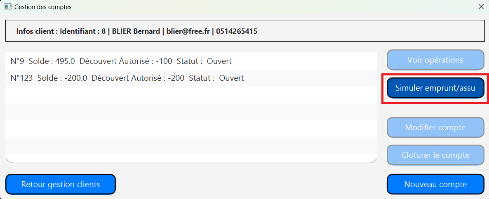

- Enfin remplissez les champs concernant la simulation de l'emprunt et validez en appuyant sur le bouton "Simulation emprunt".

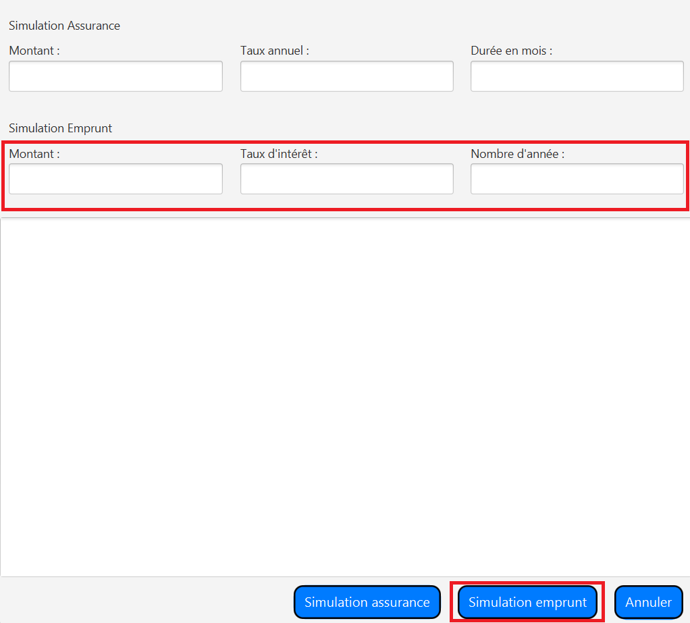

=== Simuler assurance RS

- Conditions : Il faut être connecté à un compte Chef d'Agence

- Une fois connectée, rendez vous dans -> 'Gestion' -> 'Client' comme ci-dessous.

- Selectionnez un client puis cliquer sur 'Comptes client'.

- Appuyez ensuite sur le bouton 'Simuler emprunt / assu".

- Enfin remplissez les champs concernant la simulation de l'assurance et validez en appuyant sur le bouton "Simulation assurance".

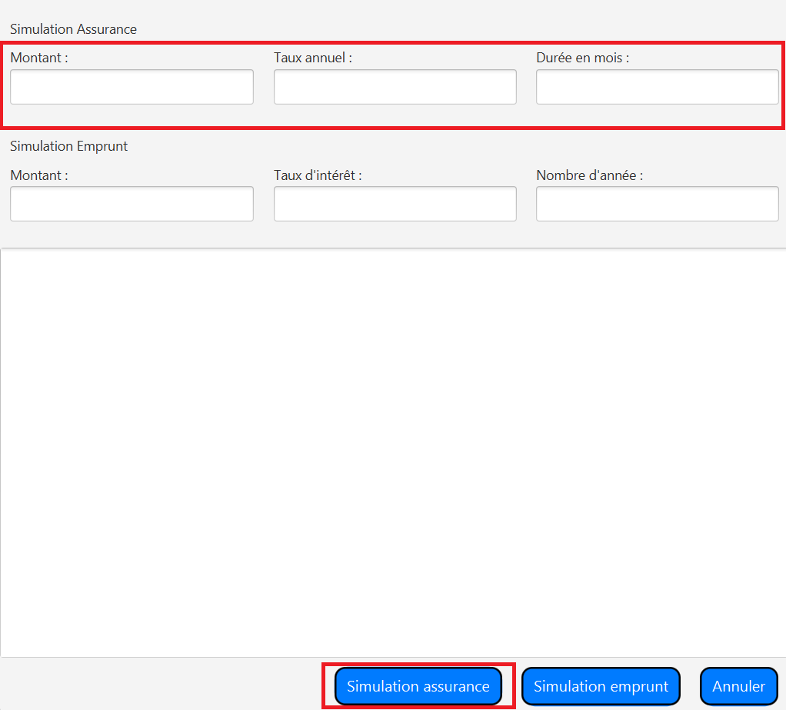

=== Relevé PDF RS

- Une fois connectée, rendez vous dans -> 'Gestion' -> 'Client' comme ci-dessous.

- Selectionnez un client puis cliquer sur 'Comptes client'.

- Selectionnez un compte puis cliquer sur 'Voir opérations'.

- Appuyez sur le bouton "Relevé PDF" pour générer un PDF du compte que vous avez sélectionné précedemment.

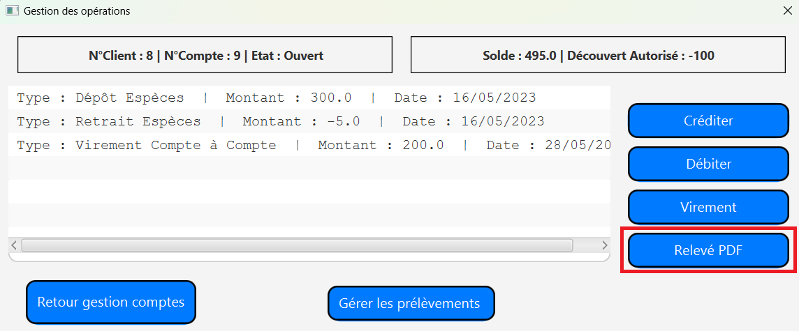

- Voilà ! Votre relevé a été créé.

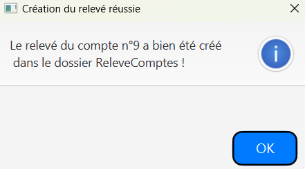

=== CRUD Prelevement Create AK

- Une fois connectée, rendez vous dans -> 'Gestion' -> 'Client' comme ci-dessous.

- Selectionnez un client puis cliquer sur 'Comptes client'.

- Selectionnez un client puis cliquer sur 'Comptes client'.

- Appuyez sur le bouton "Gérer les prélèvements" pour effectuer un prélèvement sur le compte sélectionné précedemment.

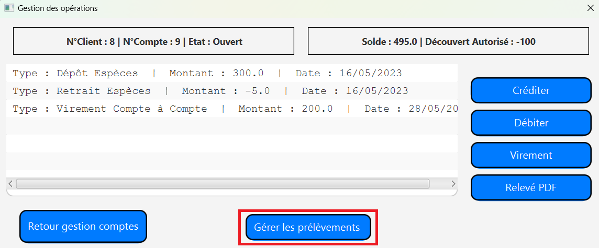

- Appuyez sur le bouton "Créer" pour ouvrir la fenêtre de création de prélèvement.

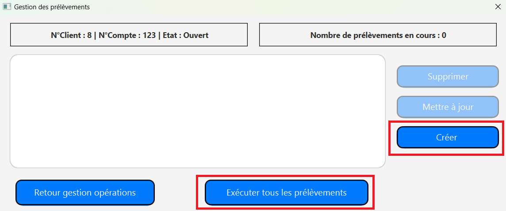

- Remplissez les champs et appuyez sur le bouton "Valider" pour créer un nouveau prélèvement, appuyez sur "Annuler" si vous ne souhaitez plus le créer.

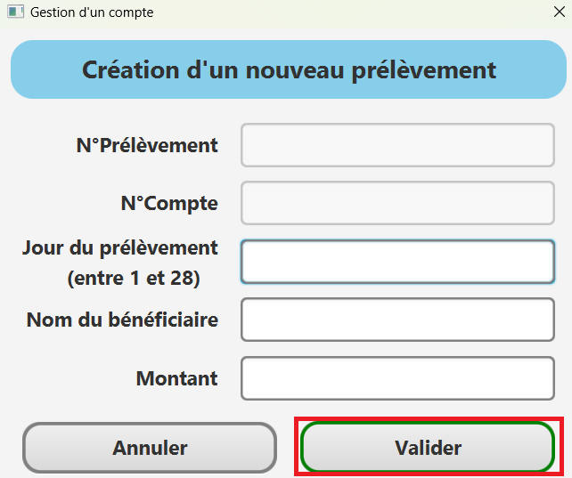

=== CRUD Prelevement Read AK

- Une fois connectée, rendez vous dans -> 'Gestion' -> 'Client' comme ci-dessous.

- Selectionnez un client puis cliquer sur 'Comptes client'.

- Selectionnez un client puis cliquer sur 'Comptes client'.

- Appuyez sur le bouton "Gérer les prélèvements" pour effectuer ou consulter un / les prélèvement(s) sur le compte sélectionné précedemment.

- Vous pouvez maintenant consulter les prélèvements du compte.

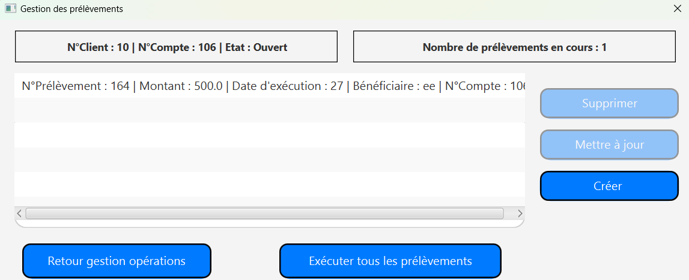

=== CRUD Prelevement Update AK

- Une fois connectée, rendez vous dans -> 'Gestion' -> 'Client' comme ci-dessous.

- Selectionnez un client puis cliquer sur 'Comptes client'.

- Selectionnez un client puis cliquer sur 'Comptes client'.

- Appuyez sur le bouton "Gérer les prélèvements" pour effectuer un prélèvement sur le compte sélectionné précedemment.

- Appuyez sur le bouton "Mettre à jour" pour ouvrir la fenêtre de mise à jour des prélèvements.

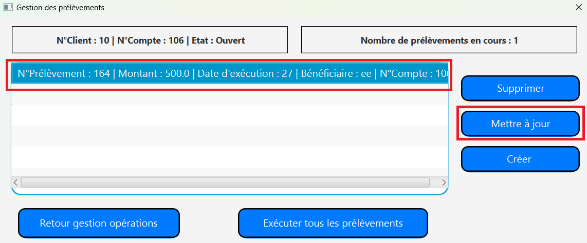

- Modifiez ce que vous voulez modifier dans les champs puis appuyez sur le bouton 'Modifier" pour appliquer les modifications.

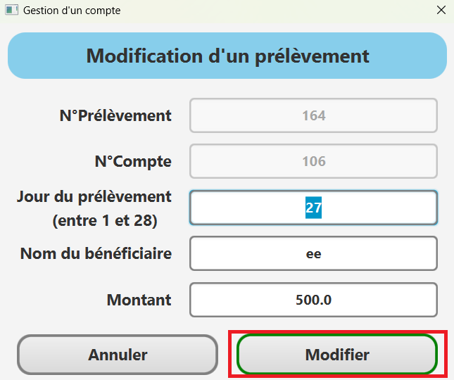

=== CRUD Prelevement Delete MAM

- Une fois connectée, rendez vous dans -> 'Gestion' -> 'Client' comme ci-dessous.

- Selectionnez un client puis cliquer sur 'Comptes client'.

- Selectionnez un client puis cliquer sur 'Comptes client'.

- Appuyez sur le bouton "Gérer les prélèvements" pour effectuer un prélèvement sur le compte sélectionné précedemment.

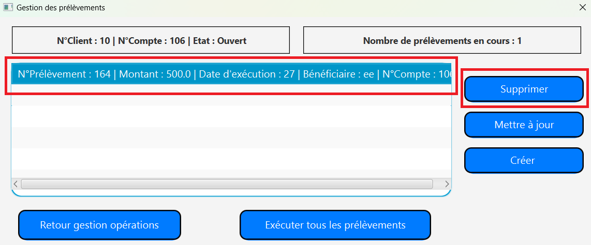
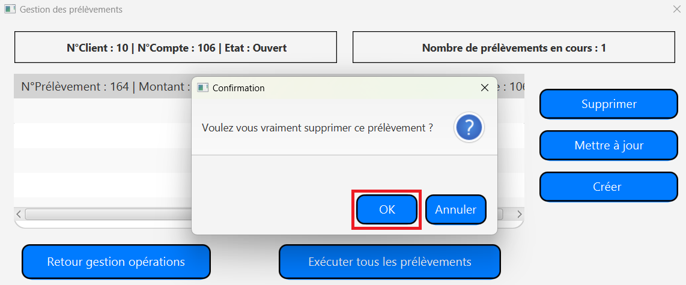
